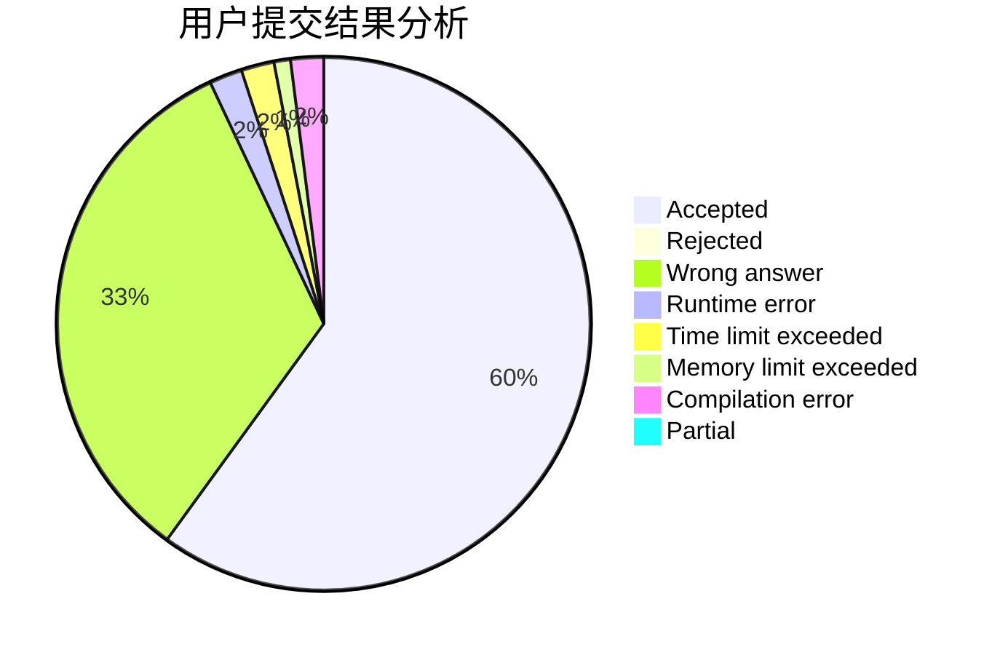
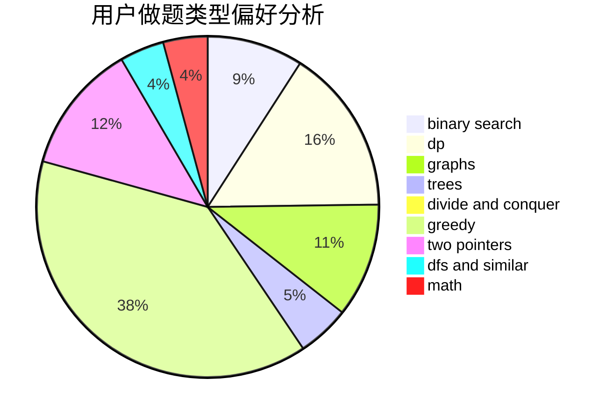

# faebdc

<!-- tabs:start -->

#### **用户提交结果分析**

#### **用户做题类型偏好分析**

<!-- tabs:end -->
# 推荐题目
[1491G](https://codeforces.com/contest/1491/problem/G)
[815B](https://codeforces.com/contest/815/problem/B)
[1302F](https://codeforces.com/contest/1302/problem/F)
[804D](https://codeforces.com/contest/804/problem/D)
[1023C](https://codeforces.com/contest/1023/problem/C)
[392A](https://codeforces.com/contest/392/problem/A)
[287C](https://codeforces.com/contest/287/problem/C)
[12272](https://codeforces.com/contest/1227/problem/2)
[464C](https://codeforces.com/contest/464/problem/C)
[1423G](https://codeforces.com/contest/1423/problem/G)
