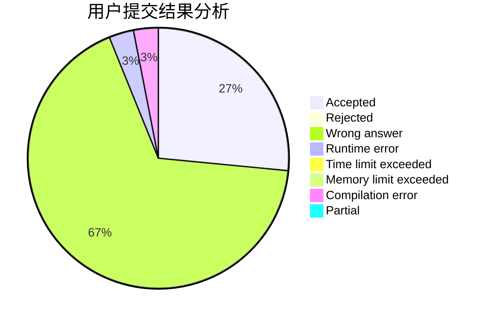
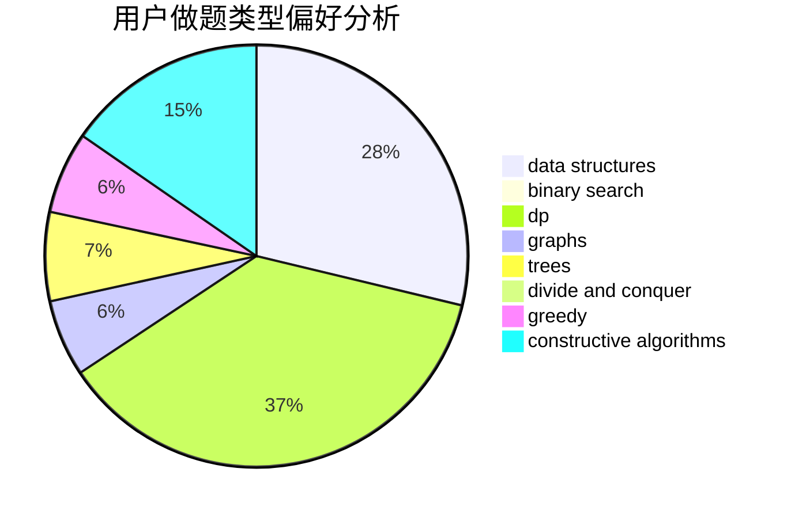
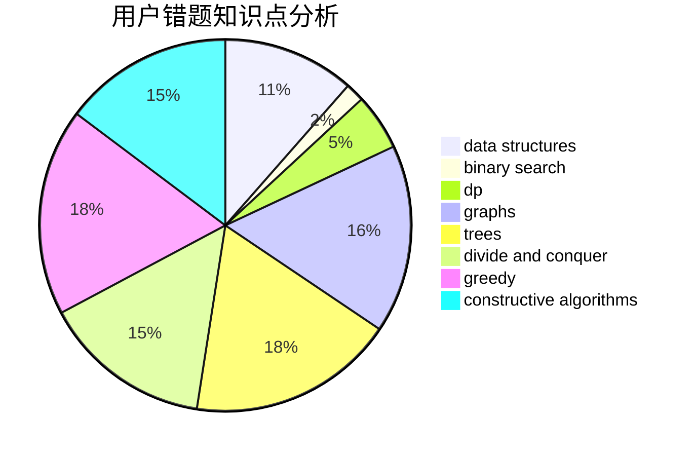

# fafafa

<!-- tabs:start -->

#### **用户提交结果分析**

#### **用户做题类型偏好分析**

#### **用户错题知识点分析**

<!-- tabs:end -->
# 推荐题目
[1200E](https://codeforces.com/contest/1200/problem/E)		brute force,
                        hashing,
                        implementation,
                        string suffix structures,
                        strings		  
[520B](https://codeforces.com/contest/520/problem/B)		dfs and similar,
                        graphs,
                        greedy,
                        implementation,
                        math,
                        shortest paths		  
[814D](https://codeforces.com/contest/814/problem/D)		dfs and similar,
                        dp,
                        geometry,
                        greedy,
                        trees		  
[990F](https://codeforces.com/contest/990/problem/F)		dfs and similar,
                        dp,
                        greedy,
                        trees		  
[899A](https://codeforces.com/contest/899/problem/A)		constructive algorithms,
                        greedy,
                        math		  
[201C](https://codeforces.com/contest/201/problem/C)		dp		  
[1265A](https://codeforces.com/contest/1265/problem/A)		constructive algorithms,
                        greedy		  
[295C](https://codeforces.com/contest/295/problem/C)		combinatorics,
                        dp,
                        graphs,
                        shortest paths		  
[150A](https://codeforces.com/contest/150/problem/A)		games,
                        math,
                        number theory		  
[1290D](https://codeforces.com/contest/1290/problem/D)		constructive algorithms,
                        graphs,
                        interactive		  
