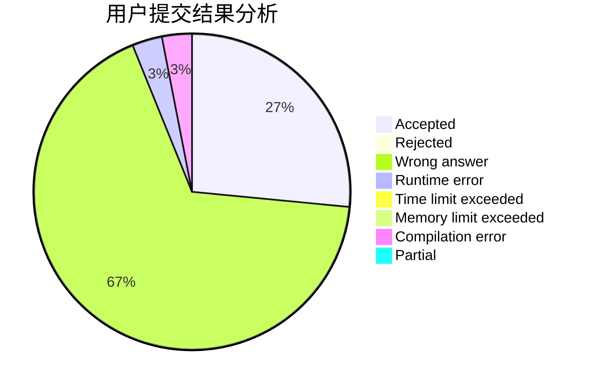
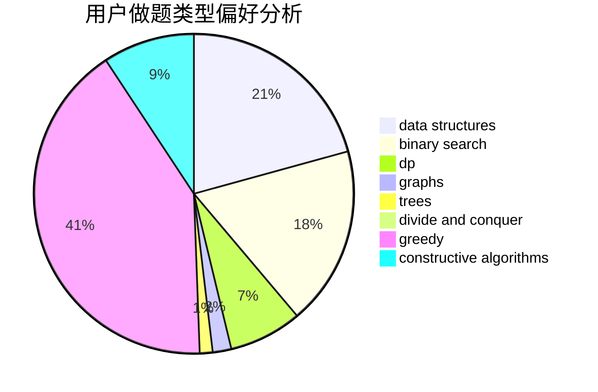
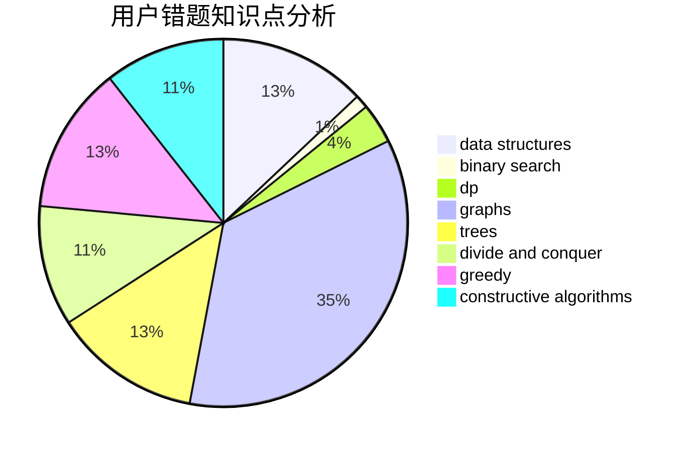

# fafafa

<!-- tabs:start -->

#### **用户提交结果分析**

#### **用户做题类型偏好分析**

#### **用户错题知识点分析**

<!-- tabs:end -->
# 推荐题目
[1197C](https://codeforces.com/contest/1197/problem/C)		greedy,
                        sortings		  
[4B](https://codeforces.com/contest/4/problem/B)		constructive algorithms,
                        greedy		  
[7C](https://codeforces.com/contest/7/problem/C)		math,
                        number theory		  
[977A](https://codeforces.com/contest/977/problem/A)		implementation		  
[878B](https://codeforces.com/contest/878/problem/B)		data structures,
                        implementation		  
[176D](https://codeforces.com/contest/176/problem/D)		dp		  
[1257F](https://codeforces.com/contest/1257/problem/F)		bitmasks,
                        brute force,
                        hashing,
                        meet-in-the-middle		  
[27D](https://codeforces.com/contest/27/problem/D)		2-sat,
                        dfs and similar,
                        dsu,
                        graphs		  
[1499G](https://codeforces.com/contest/1499/problem/G)		data structures,
                        graphs,
                        interactive		  
[1283D](https://codeforces.com/contest/1283/problem/D)		graphs,
                        greedy,
                        shortest paths		  
