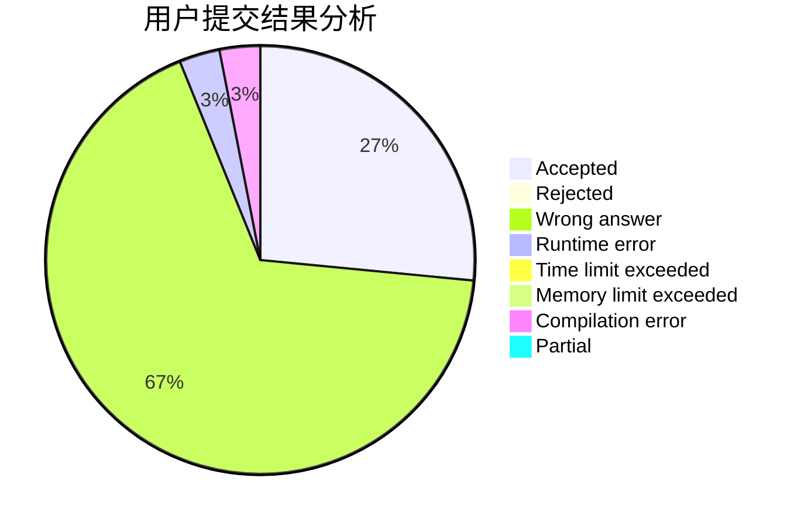
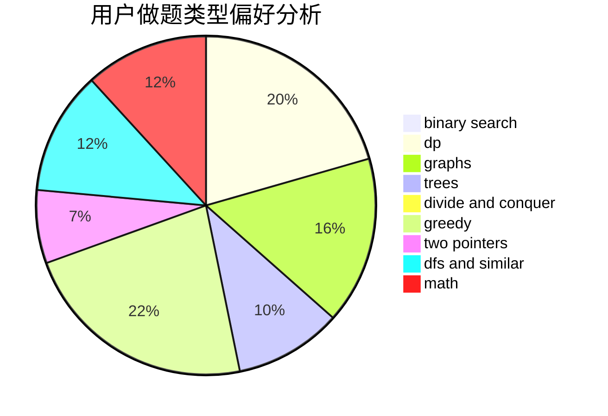

# fafafa

<!-- tabs:start -->

#### **用户提交结果分析**

#### **用户做题类型偏好分析**

<!-- tabs:end -->
# 推荐题目
[1200E](https://codeforces.com/contest/1200/problem/E)
[520B](https://codeforces.com/contest/520/problem/B)
[814D](https://codeforces.com/contest/814/problem/D)
[990F](https://codeforces.com/contest/990/problem/F)
[899A](https://codeforces.com/contest/899/problem/A)
[201C](https://codeforces.com/contest/201/problem/C)
[1265A](https://codeforces.com/contest/1265/problem/A)
[295C](https://codeforces.com/contest/295/problem/C)
[150A](https://codeforces.com/contest/150/problem/A)
[1290D](https://codeforces.com/contest/1290/problem/D)
