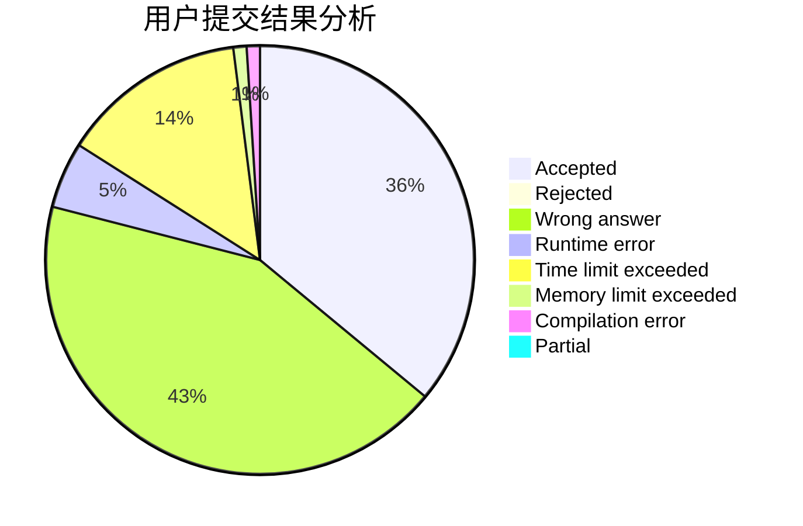
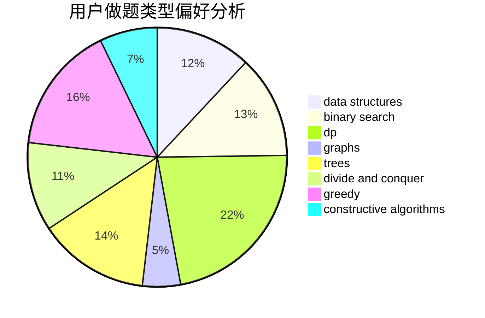

# Astar_always_running

<!-- tabs:start -->

#### **用户提交结果分析**

#### **用户做题类型偏好分析**

#### **用户错题知识点分析**

<!-- tabs:end -->
# 推荐题目
[1295E](https://codeforces.com/contest/1295/problem/E)		data structures,
                        divide and conquer		  
[442B](https://codeforces.com/contest/442/problem/B)		greedy,
                        math,
                        probabilities		  
[456B](https://codeforces.com/contest/456/problem/B)		math,
                        number theory		  
[459C](https://codeforces.com/contest/459/problem/C)		combinatorics,
                        constructive algorithms,
                        math		  
[1246F](https://codeforces.com/contest/1246/problem/F)		nan		  
[158E](https://codeforces.com/contest/158/problem/E)		*special problem,
                        dp,
                        sortings		  
[457E](https://codeforces.com/contest/457/problem/E)		constructive algorithms,
                        flows,
                        math		  
[260D](https://codeforces.com/contest/260/problem/D)		constructive algorithms,
                        dsu,
                        graphs,
                        greedy,
                        trees		  
[1434E](https://codeforces.com/contest/1434/problem/E)		dsu,
                        games		  
[1137B](https://codeforces.com/contest/1137/problem/B)		greedy,
                        hashing,
                        strings		  
