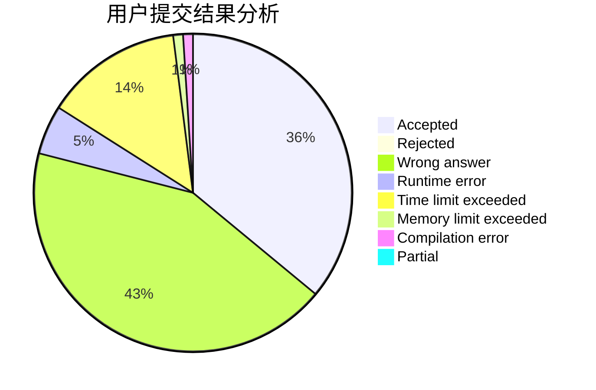
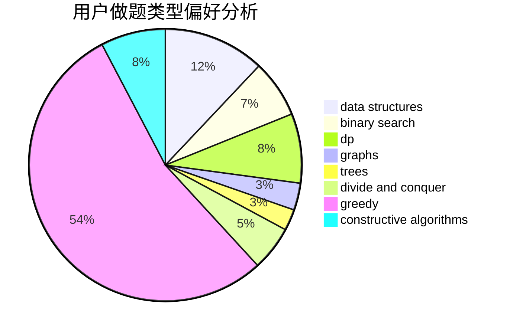

# Astar_always_running

<!-- tabs:start -->

#### **用户提交结果分析**

#### **用户做题类型偏好分析**

#### **用户错题知识点分析**

<!-- tabs:end -->
# 推荐题目
[1288C](https://codeforces.com/contest/1288/problem/C)		combinatorics,
                        dp		  
[417C](https://codeforces.com/contest/417/problem/C)		constructive algorithms,
                        graphs,
                        implementation		  
[436B](https://codeforces.com/contest/436/problem/B)		implementation,
                        math		  
[437A](https://codeforces.com/contest/437/problem/A)		implementation		  
[1241B](https://codeforces.com/contest/1241/problem/B)		dsu,graphs,sortings,trees		  
[1508A](https://codeforces.com/contest/1508/problem/A)		constructive algorithms,
                        greedy,
                        implementation,
                        math,
                        strings,
                        two pointers		  
[436E](https://codeforces.com/contest/436/problem/E)		data structures,
                        greedy		  
[23B](https://codeforces.com/contest/23/problem/B)		constructive algorithms,
                        graphs,
                        math		  
[1426C](https://codeforces.com/contest/1426/problem/C)		binary search,
                        constructive algorithms,
                        math		  
[1133A](https://codeforces.com/contest/1133/problem/A)		implementation		  
