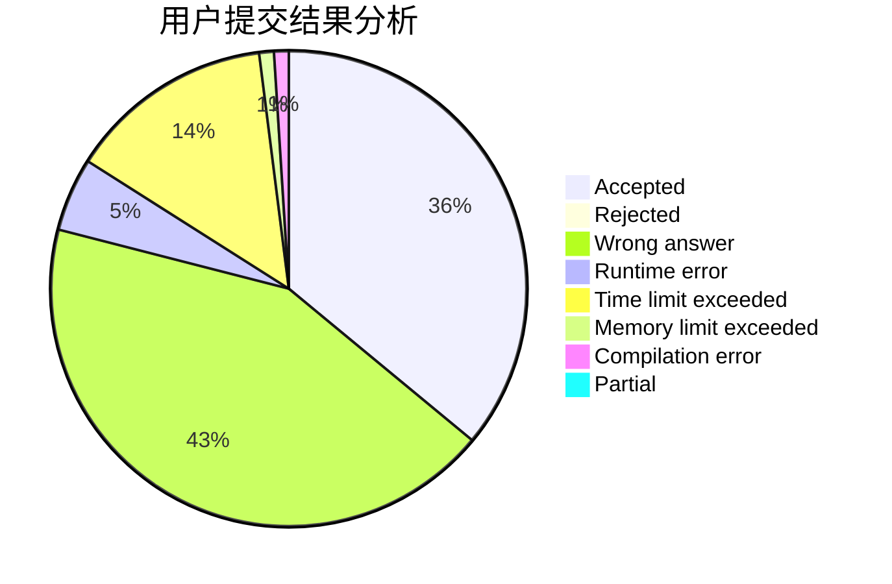
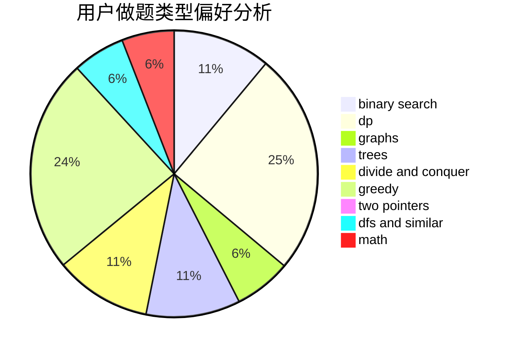

# Astar_always_running

<!-- tabs:start -->

#### **用户提交结果分析**

#### **用户做题类型偏好分析**

<!-- tabs:end -->
# 推荐题目
[1295E](https://codeforces.com/contest/1295/problem/E)
[442B](https://codeforces.com/contest/442/problem/B)
[456B](https://codeforces.com/contest/456/problem/B)
[459C](https://codeforces.com/contest/459/problem/C)
[1246F](https://codeforces.com/contest/1246/problem/F)
[158E](https://codeforces.com/contest/158/problem/E)
[457E](https://codeforces.com/contest/457/problem/E)
[260D](https://codeforces.com/contest/260/problem/D)
[1434E](https://codeforces.com/contest/1434/problem/E)
[1137B](https://codeforces.com/contest/1137/problem/B)
