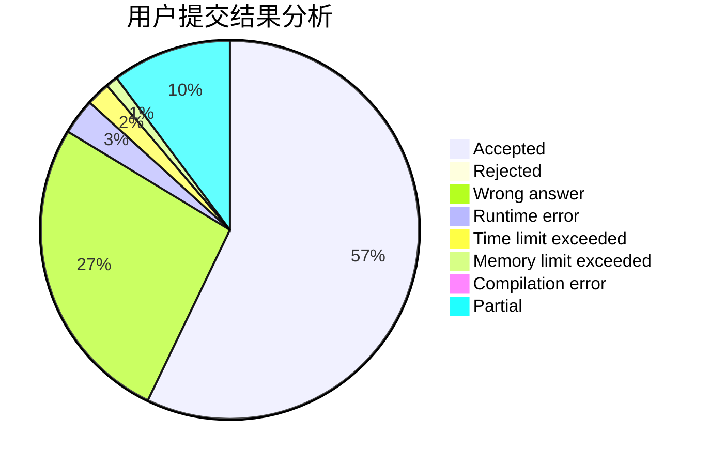
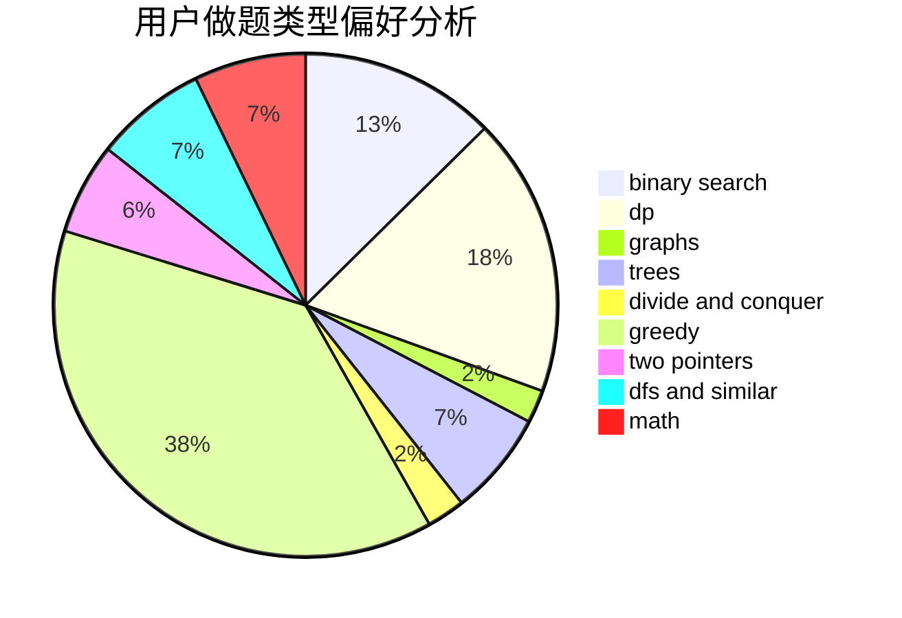

# fallleaves01

<!-- tabs:start -->

#### **用户提交结果分析**

#### **用户做题类型偏好分析**

<!-- tabs:end -->
# 推荐题目
[1146A](https://codeforces.com/contest/1146/problem/A)
[1482B](https://codeforces.com/contest/1482/problem/B)
[1395F](https://codeforces.com/contest/1395/problem/F)
[571C](https://codeforces.com/contest/571/problem/C)
[575C](https://codeforces.com/contest/575/problem/C)
[243D](https://codeforces.com/contest/243/problem/D)
[978G](https://codeforces.com/contest/978/problem/G)
[128C](https://codeforces.com/contest/128/problem/C)
[466D](https://codeforces.com/contest/466/problem/D)
[253A](https://codeforces.com/contest/253/problem/A)
