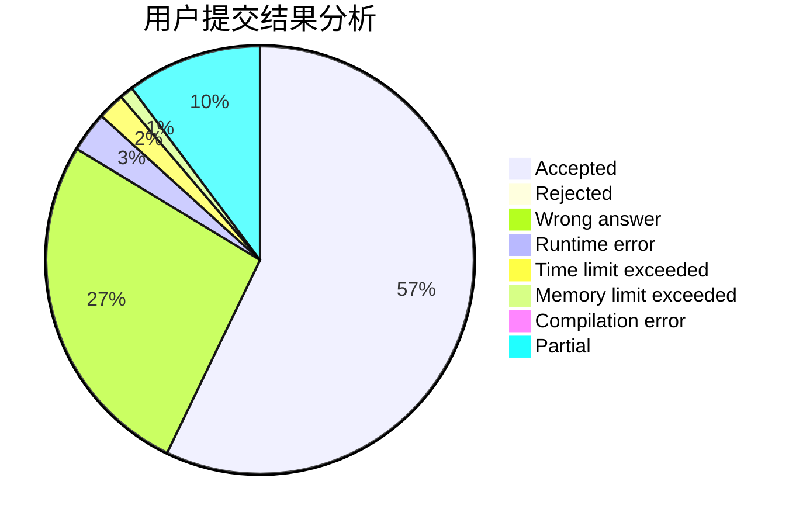
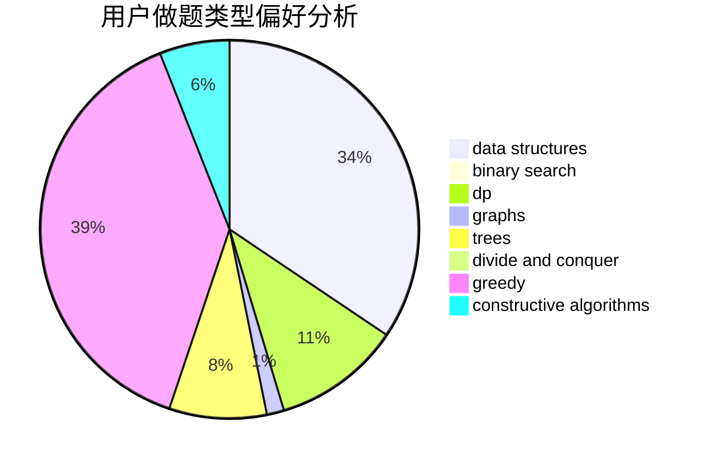
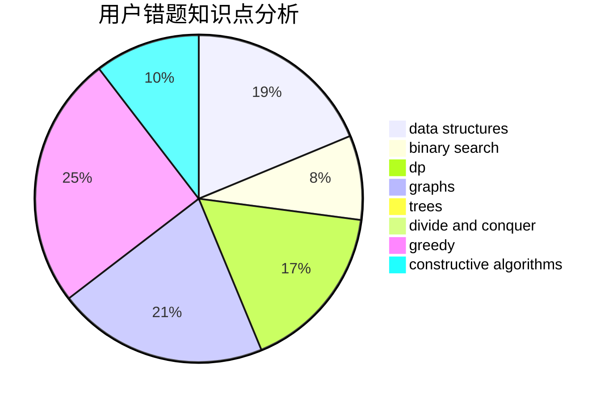

# fallleaves01

<!-- tabs:start -->

#### **用户提交结果分析**

#### **用户做题类型偏好分析**

#### **用户错题知识点分析**

<!-- tabs:end -->
# 推荐题目
[1146A](https://codeforces.com/contest/1146/problem/A)		implementation,
                        strings		  
[1482B](https://codeforces.com/contest/1482/problem/B)		implementation,
                        math		  
[1395F](https://codeforces.com/contest/1395/problem/F)		dsu,graphs,sortings,trees		  
[571C](https://codeforces.com/contest/571/problem/C)		constructive algorithms,
                        dfs and similar,
                        graphs,
                        greedy		  
[575C](https://codeforces.com/contest/575/problem/C)		bitmasks,
                        brute force,
                        graph matchings		  
[243D](https://codeforces.com/contest/243/problem/D)		data structures,
                        dp,
                        geometry,
                        two pointers		  
[978G](https://codeforces.com/contest/978/problem/G)		greedy,
                        implementation,
                        sortings		  
[128C](https://codeforces.com/contest/128/problem/C)		combinatorics,
                        dp		  
[466D](https://codeforces.com/contest/466/problem/D)		combinatorics,
                        dp		  
[253A](https://codeforces.com/contest/253/problem/A)		greedy		  
