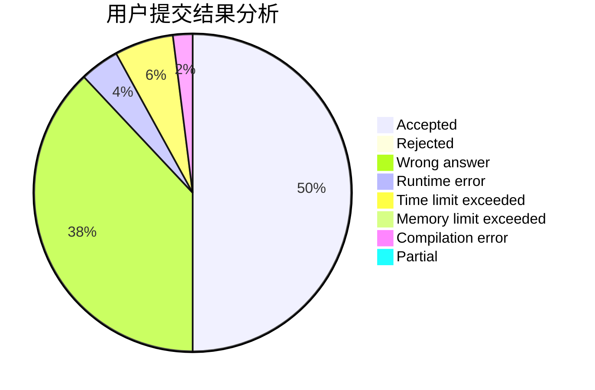
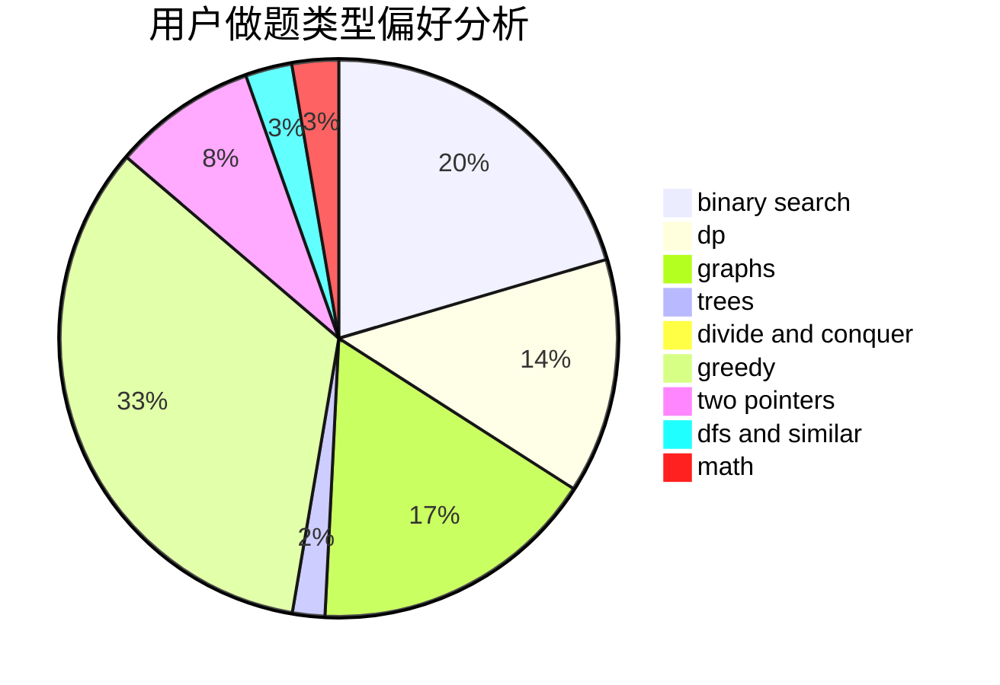

# fanfansann

<!-- tabs:start -->

#### **用户提交结果分析**

#### **用户做题类型偏好分析**

<!-- tabs:end -->
# 推荐题目
[1396B](https://codeforces.com/contest/1396/problem/B)
[1337C](https://codeforces.com/contest/1337/problem/C)
[1393D](https://codeforces.com/contest/1393/problem/D)
[804D](https://codeforces.com/contest/804/problem/D)
[17C](https://codeforces.com/contest/17/problem/C)
[535C](https://codeforces.com/contest/535/problem/C)
[656F](https://codeforces.com/contest/656/problem/F)
[1310B](https://codeforces.com/contest/1310/problem/B)
[1060E](https://codeforces.com/contest/1060/problem/E)
[954C](https://codeforces.com/contest/954/problem/C)
