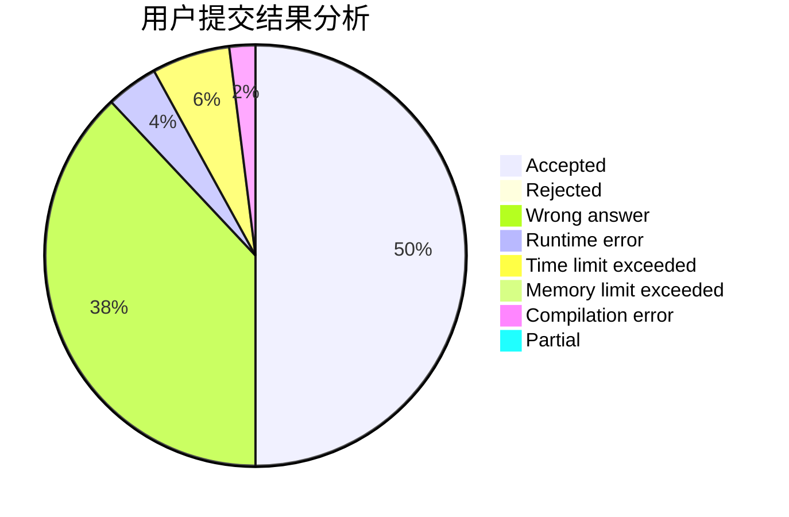
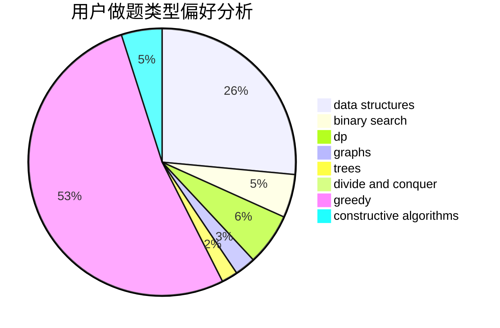
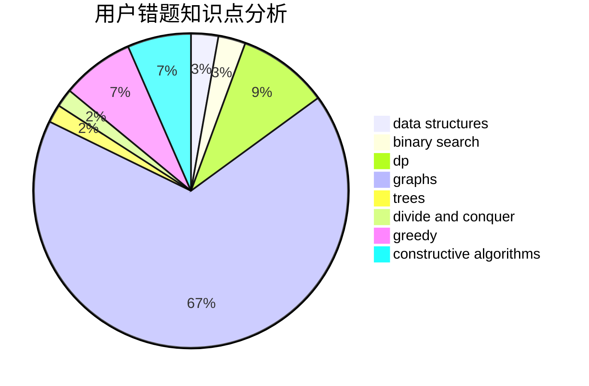

# fanfansann

<!-- tabs:start -->

#### **用户提交结果分析**

#### **用户做题类型偏好分析**

#### **用户错题知识点分析**

<!-- tabs:end -->
# 推荐题目
[1386A](https://codeforces.com/contest/1386/problem/A)		*special problem,
                        binary search,
                        constructive algorithms,
                        interactive		  
[1331D](https://codeforces.com/contest/1331/problem/D)		implementation		  
[1384A](https://codeforces.com/contest/1384/problem/A)		constructive algorithms,
                        greedy,
                        strings		  
[789B](https://codeforces.com/contest/789/problem/B)		brute force,
                        implementation,
                        math		  
[158A](https://codeforces.com/contest/158/problem/A)		*special problem,
                        implementation		  
[512C](https://codeforces.com/contest/512/problem/C)		dsu,graphs,sortings,trees		  
[628F](https://codeforces.com/contest/628/problem/F)		flows		  
[1300D](https://codeforces.com/contest/1300/problem/D)		dsu,graphs,sortings,trees		  
[1060B](https://codeforces.com/contest/1060/problem/B)		greedy		  
[932C](https://codeforces.com/contest/932/problem/C)		brute force,
                        constructive algorithms		  
