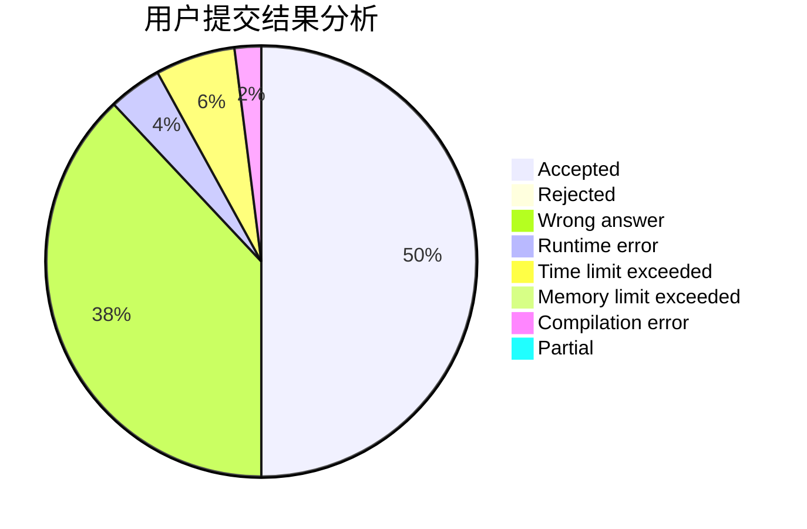
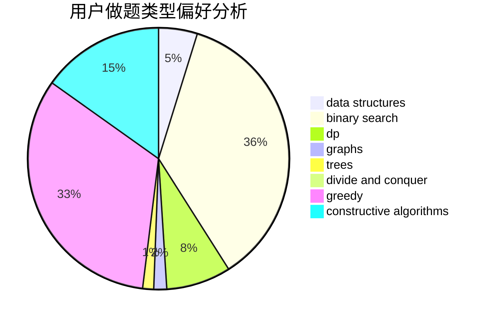
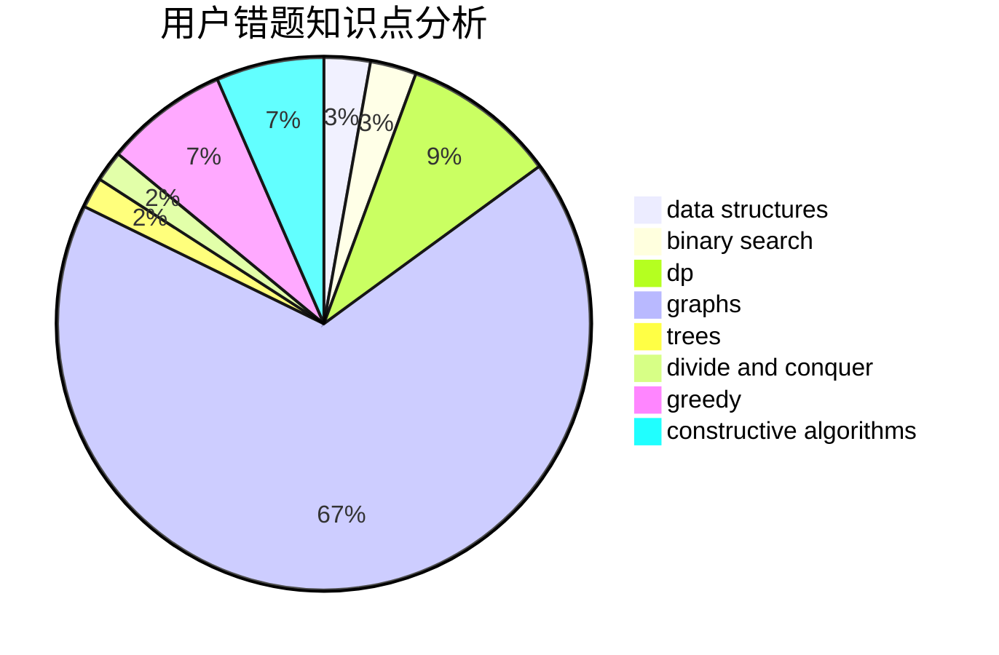

# fanfansann

<!-- tabs:start -->

#### **用户提交结果分析**

#### **用户做题类型偏好分析**

#### **用户错题知识点分析**

<!-- tabs:end -->
# 推荐题目
[1396B](https://codeforces.com/contest/1396/problem/B)		brute force,
                        constructive algorithms,
                        games,
                        greedy		  
[1337C](https://codeforces.com/contest/1337/problem/C)		dsu,graphs,sortings,trees		  
[1393D](https://codeforces.com/contest/1393/problem/D)		dfs and similar,
                        dp,
                        implementation,
                        shortest paths		  
[804D](https://codeforces.com/contest/804/problem/D)		binary search,
                        brute force,
                        dfs and similar,
                        dp,
                        sortings,
                        trees		  
[17C](https://codeforces.com/contest/17/problem/C)		dp		  
[535C](https://codeforces.com/contest/535/problem/C)		binary search,
                        greedy,
                        math		  
[656F](https://codeforces.com/contest/656/problem/F)		*special problem		  
[1310B](https://codeforces.com/contest/1310/problem/B)		dp,
                        implementation		  
[1060E](https://codeforces.com/contest/1060/problem/E)		dfs and similar,
                        dp,
                        trees		  
[954C](https://codeforces.com/contest/954/problem/C)		implementation		  
