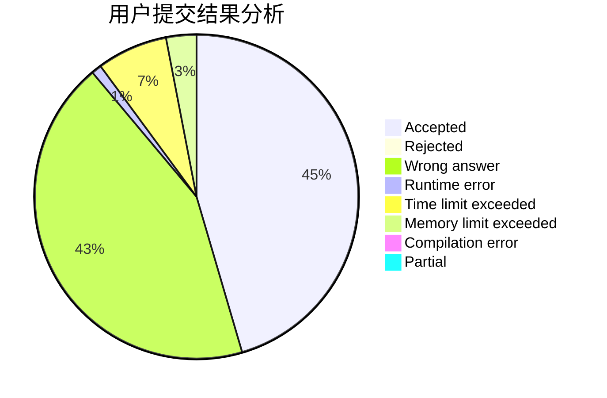
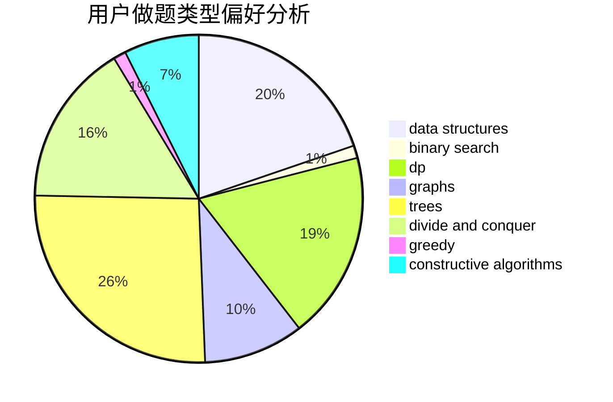

# fangbo

<!-- tabs:start -->

#### **用户提交结果分析**

#### **用户做题类型偏好分析**

#### **用户错题知识点分析**

<!-- tabs:end -->
# 推荐题目
[1280E](https://codeforces.com/contest/1280/problem/E)		math		  
[397E](https://codeforces.com/contest/397/problem/E)		dsu,graphs,sortings,trees		  
[183A](https://codeforces.com/contest/183/problem/A)		constructive algorithms,
                        math		  
[629A](https://codeforces.com/contest/629/problem/A)		brute force,
                        combinatorics,
                        constructive algorithms,
                        implementation		  
[499C](https://codeforces.com/contest/499/problem/C)		dsu,graphs,sortings,trees		  
[732D](https://codeforces.com/contest/732/problem/D)		binary search,
                        greedy,
                        sortings		  
[1470F](https://codeforces.com/contest/1470/problem/F)		divide and conquer		  
[171C](https://codeforces.com/contest/171/problem/C)		*special problem,
                        implementation		  
[1477E](https://codeforces.com/contest/1477/problem/E)		data structures,
                        greedy		  
[1462F](https://codeforces.com/contest/1462/problem/F)		binary search,
                        data structures,
                        greedy		  
