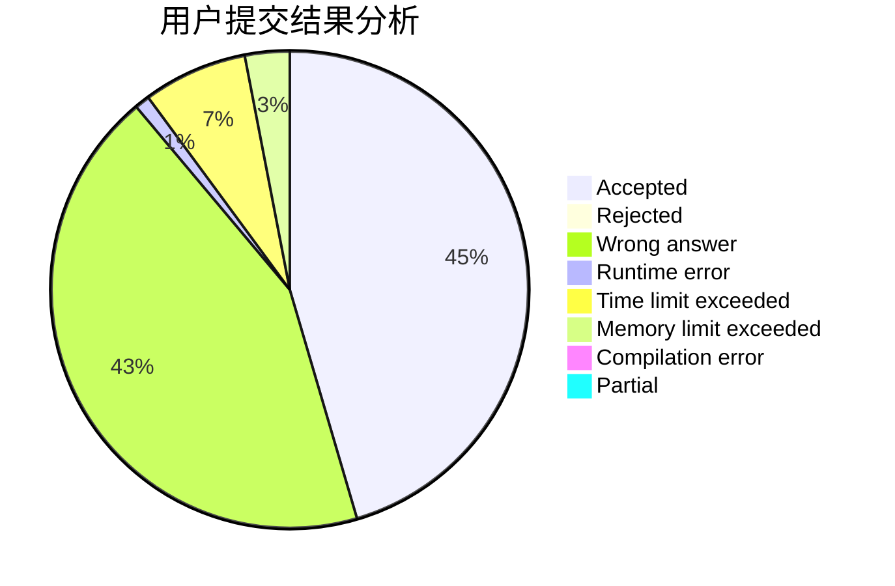
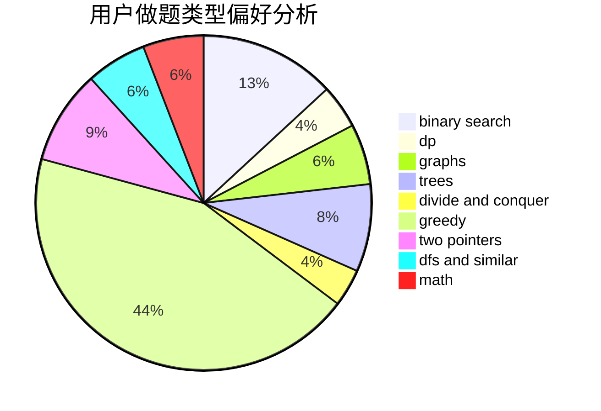

# fangbo

<!-- tabs:start -->

#### **用户提交结果分析**

#### **用户做题类型偏好分析**

<!-- tabs:end -->
# 推荐题目
[1280E](https://codeforces.com/contest/1280/problem/E)
[397E](https://codeforces.com/contest/397/problem/E)
[183A](https://codeforces.com/contest/183/problem/A)
[629A](https://codeforces.com/contest/629/problem/A)
[499C](https://codeforces.com/contest/499/problem/C)
[732D](https://codeforces.com/contest/732/problem/D)
[1470F](https://codeforces.com/contest/1470/problem/F)
[171C](https://codeforces.com/contest/171/problem/C)
[1477E](https://codeforces.com/contest/1477/problem/E)
[1462F](https://codeforces.com/contest/1462/problem/F)
