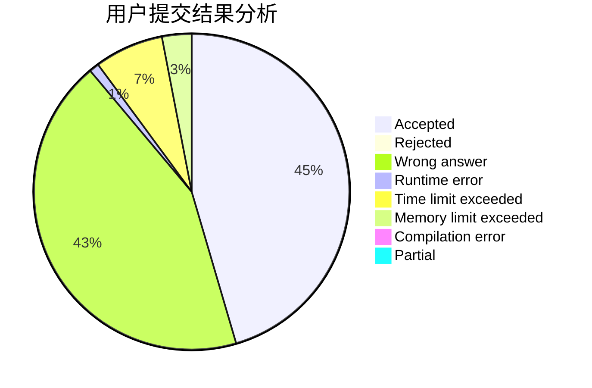
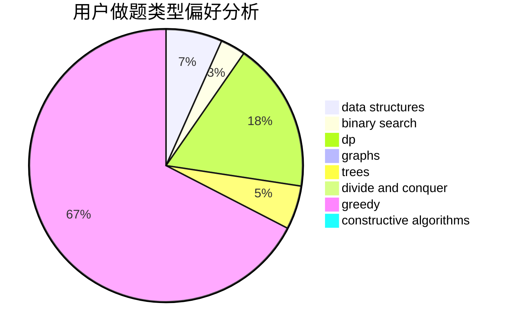

# fangbo

<!-- tabs:start -->

#### **用户提交结果分析**

#### **用户做题类型偏好分析**

#### **用户错题知识点分析**

<!-- tabs:end -->
# 推荐题目
[1271C](https://codeforces.com/contest/1271/problem/C)		brute force,
                        geometry,
                        greedy,
                        implementation		  
[367A](https://codeforces.com/contest/367/problem/A)		data structures,
                        implementation		  
[15D](https://codeforces.com/contest/15/problem/D)		data structures,
                        implementation,
                        sortings		  
[609F](https://codeforces.com/contest/609/problem/F)		data structures,
                        greedy		  
[479A](https://codeforces.com/contest/479/problem/A)		brute force,
                        math		  
[713D](https://codeforces.com/contest/713/problem/D)		binary search,
                        data structures		  
[1463E](https://codeforces.com/contest/1463/problem/E)		constructive algorithms,
                        dfs and similar,
                        dsu,
                        graphs,
                        implementation,
                        sortings,
                        trees		  
[1512C](https://codeforces.com/contest/1512/problem/C)		constructive algorithms,
                        implementation,
                        strings		  
[1469D](https://codeforces.com/contest/1469/problem/D)		brute force,
                        constructive algorithms,
                        math,
                        number theory		  
[1453C](https://codeforces.com/contest/1453/problem/C)		greedy,
                        implementation		  
