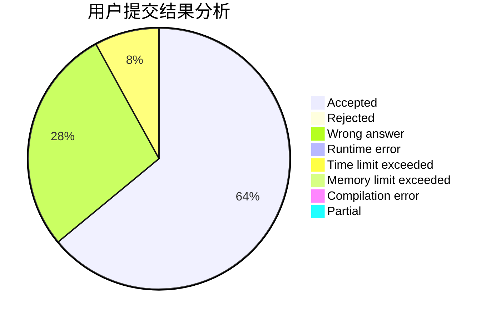
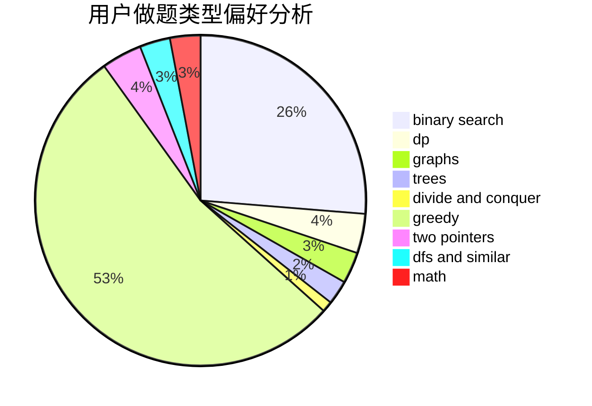

# fangxihao

<!-- tabs:start -->

#### **用户提交结果分析**

#### **用户做题类型偏好分析**

<!-- tabs:end -->
# 推荐题目
[701E](https://codeforces.com/contest/701/problem/E)
[193D](https://codeforces.com/contest/193/problem/D)
[215C](https://codeforces.com/contest/215/problem/C)
[784C](https://codeforces.com/contest/784/problem/C)
[1307E](https://codeforces.com/contest/1307/problem/E)
[1081G](https://codeforces.com/contest/1081/problem/G)
[352A](https://codeforces.com/contest/352/problem/A)
[962F](https://codeforces.com/contest/962/problem/F)
[1090F](https://codeforces.com/contest/1090/problem/F)
[341C](https://codeforces.com/contest/341/problem/C)
