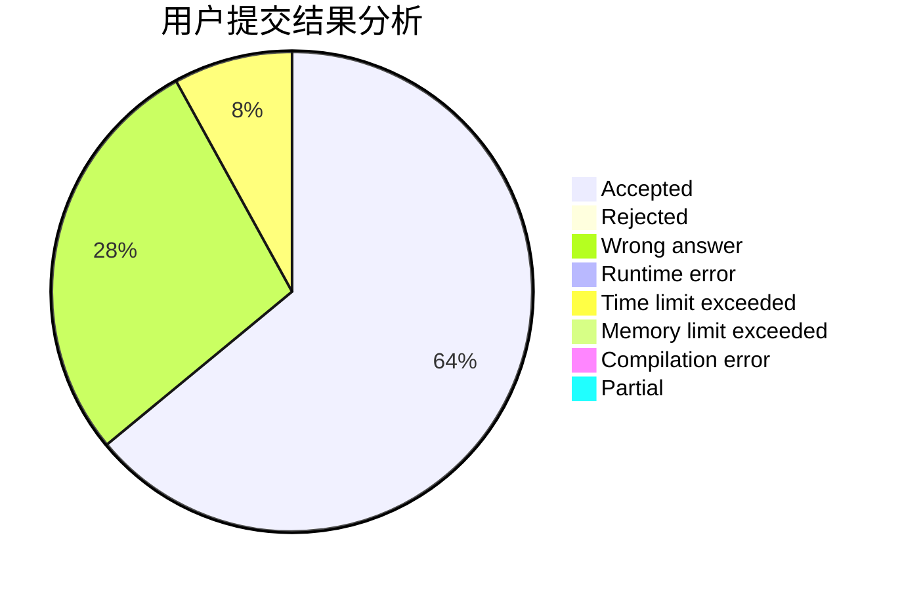
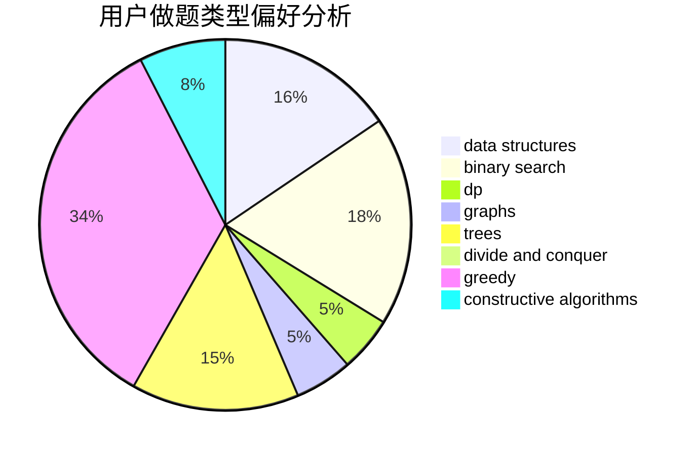

# fangxihao

<!-- tabs:start -->

#### **用户提交结果分析**

#### **用户做题类型偏好分析**

#### **用户错题知识点分析**

<!-- tabs:end -->
# 推荐题目
[678A](https://codeforces.com/contest/678/problem/A)		implementation,
                        math		  
[167C](https://codeforces.com/contest/167/problem/C)		games,
                        math		  
[18E](https://codeforces.com/contest/18/problem/E)		dp		  
[764E](https://codeforces.com/contest/764/problem/E)		dsu,graphs,sortings,trees		  
[12D](https://codeforces.com/contest/12/problem/D)		data structures,
                        sortings		  
[1081D](https://codeforces.com/contest/1081/problem/D)		dsu,
                        graphs,
                        shortest paths,
                        sortings		  
[321B](https://codeforces.com/contest/321/problem/B)		dp,
                        flows,
                        greedy		  
[946B](https://codeforces.com/contest/946/problem/B)		math,
                        number theory		  
[1090A](https://codeforces.com/contest/1090/problem/A)		greedy		  
[316C2](https://codeforces.com/contest/316C/problem/2)		flows,
                        graph matchings		  
