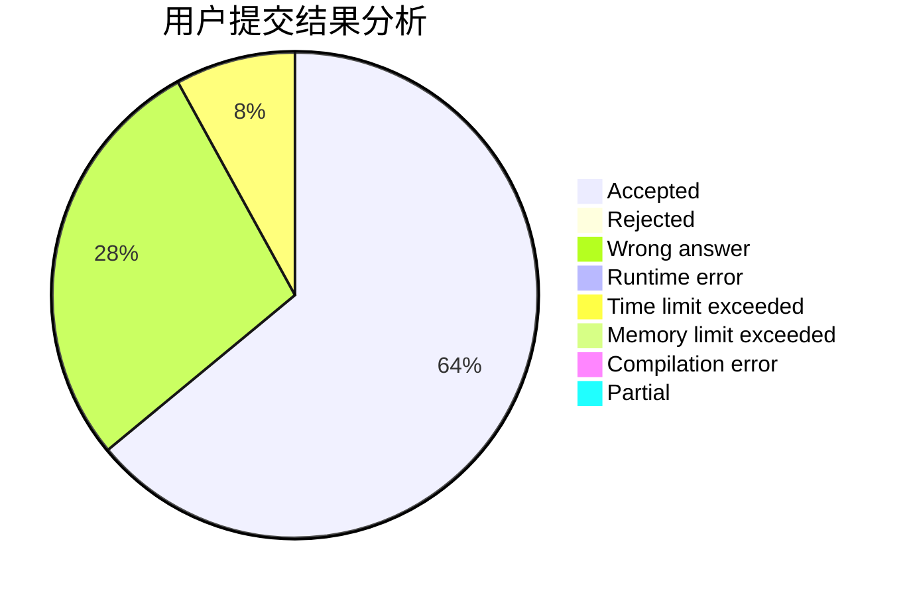
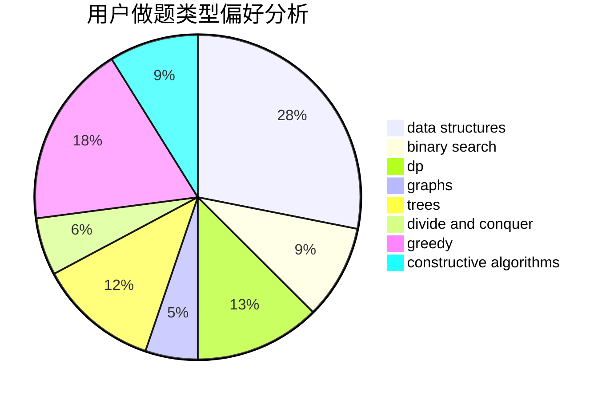

# fangxihao

<!-- tabs:start -->

#### **用户提交结果分析**

#### **用户做题类型偏好分析**

#### **用户错题知识点分析**

<!-- tabs:end -->
# 推荐题目
[701E](https://codeforces.com/contest/701/problem/E)		dsu,graphs,sortings,trees		  
[193D](https://codeforces.com/contest/193/problem/D)		data structures		  
[215C](https://codeforces.com/contest/215/problem/C)		brute force,
                        implementation		  
[784C](https://codeforces.com/contest/784/problem/C)		*special problem,
                        implementation		  
[1307E](https://codeforces.com/contest/1307/problem/E)		binary search,
                        combinatorics,
                        dp,
                        greedy,
                        implementation,
                        math		  
[1081G](https://codeforces.com/contest/1081/problem/G)		math,
                        probabilities		  
[352A](https://codeforces.com/contest/352/problem/A)		brute force,
                        implementation,
                        math		  
[962F](https://codeforces.com/contest/962/problem/F)		dfs and similar,
                        graphs,
                        trees		  
[1090F](https://codeforces.com/contest/1090/problem/F)		constructive algorithms,
                        interactive		  
[341C](https://codeforces.com/contest/341/problem/C)		dsu,graphs,sortings,trees		  
