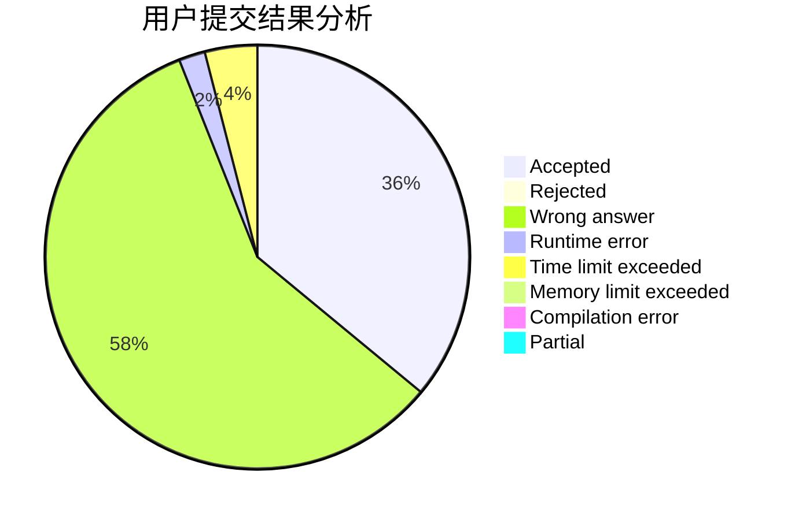
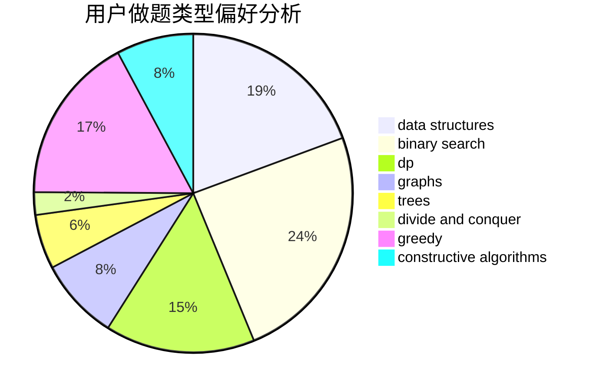
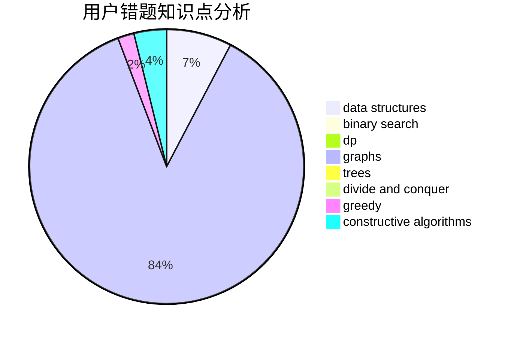

# fanzero

<!-- tabs:start -->

#### **用户提交结果分析**

#### **用户做题类型偏好分析**

#### **用户错题知识点分析**

<!-- tabs:end -->
# 推荐题目
[615D](https://codeforces.com/contest/615/problem/D)		math,
                        number theory		  
[381B](https://codeforces.com/contest/381/problem/B)		greedy,
                        implementation,
                        sortings		  
[1076F](https://codeforces.com/contest/1076/problem/F)		dp,
                        greedy		  
[735C](https://codeforces.com/contest/735/problem/C)		combinatorics,
                        constructive algorithms,
                        greedy,
                        math		  
[1183H](https://codeforces.com/contest/1183/problem/H)		dp,
                        strings		  
[1083B](https://codeforces.com/contest/1083/problem/B)		greedy,
                        strings		  
[544C](https://codeforces.com/contest/544/problem/C)		dsu,graphs,sortings,trees		  
[95E](https://codeforces.com/contest/95/problem/E)		dp,
                        dsu,
                        graphs		  
[490E](https://codeforces.com/contest/490/problem/E)		binary search,
                        brute force,
                        greedy,
                        implementation		  
[800A](https://codeforces.com/contest/800/problem/A)		dsu,graphs,sortings,trees		  
