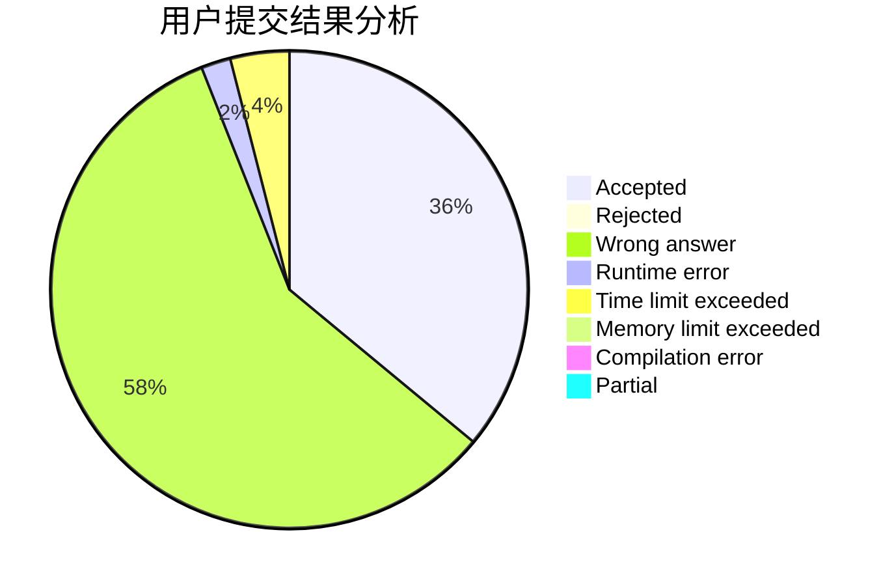
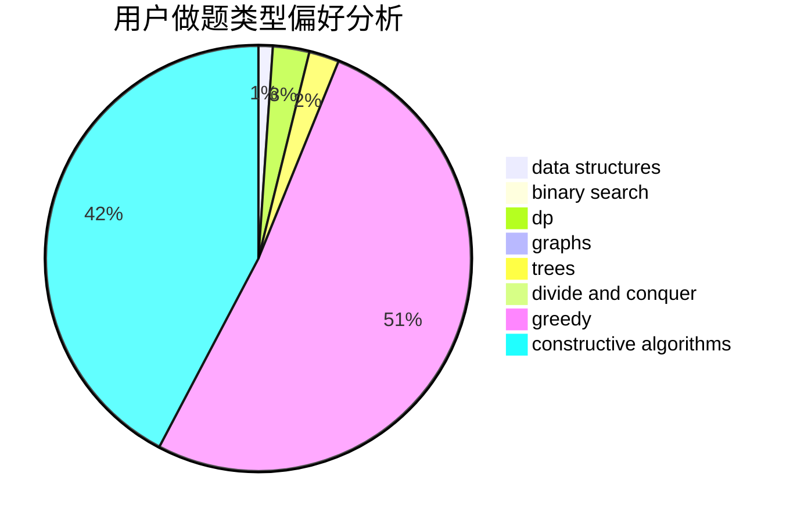
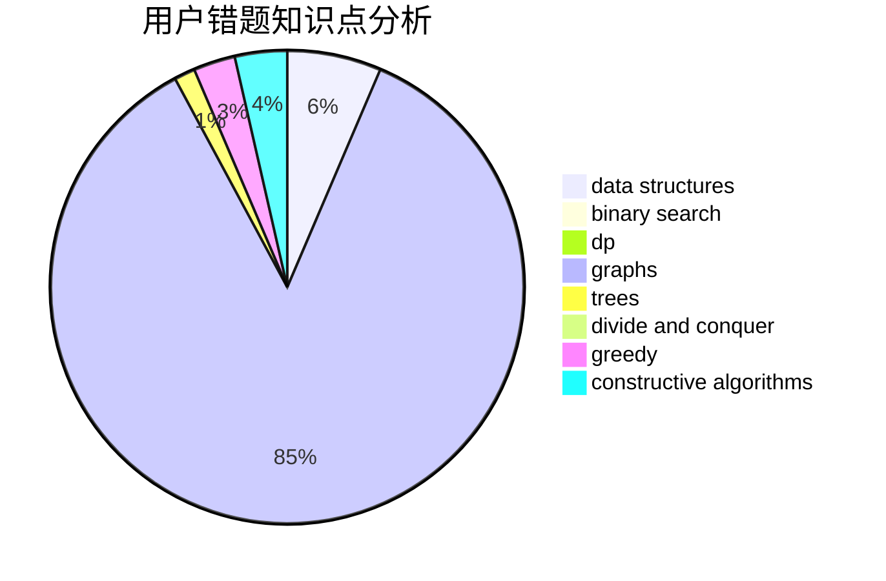

# fanzero

<!-- tabs:start -->

#### **用户提交结果分析**

#### **用户做题类型偏好分析**

#### **用户错题知识点分析**

<!-- tabs:end -->
# 推荐题目
[598A](https://codeforces.com/contest/598/problem/A)		math		  
[356C](https://codeforces.com/contest/356/problem/C)		combinatorics,
                        constructive algorithms,
                        greedy,
                        implementation		  
[1076C](https://codeforces.com/contest/1076/problem/C)		binary search,
                        math		  
[717I](https://codeforces.com/contest/717/problem/I)		geometry		  
[1181C](https://codeforces.com/contest/1181/problem/C)		brute force,
                        combinatorics,
                        dp,
                        implementation		  
[1082F](https://codeforces.com/contest/1082/problem/F)		dp,
                        strings,
                        trees		  
[518F](https://codeforces.com/contest/518/problem/F)		binary search,
                        brute force,
                        combinatorics,
                        dp,
                        implementation		  
[938D](https://codeforces.com/contest/938/problem/D)		data structures,
                        graphs,
                        shortest paths		  
[472B](https://codeforces.com/contest/472/problem/B)		nan		  
[782B](https://codeforces.com/contest/782/problem/B)		dsu,graphs,sortings,trees		  
