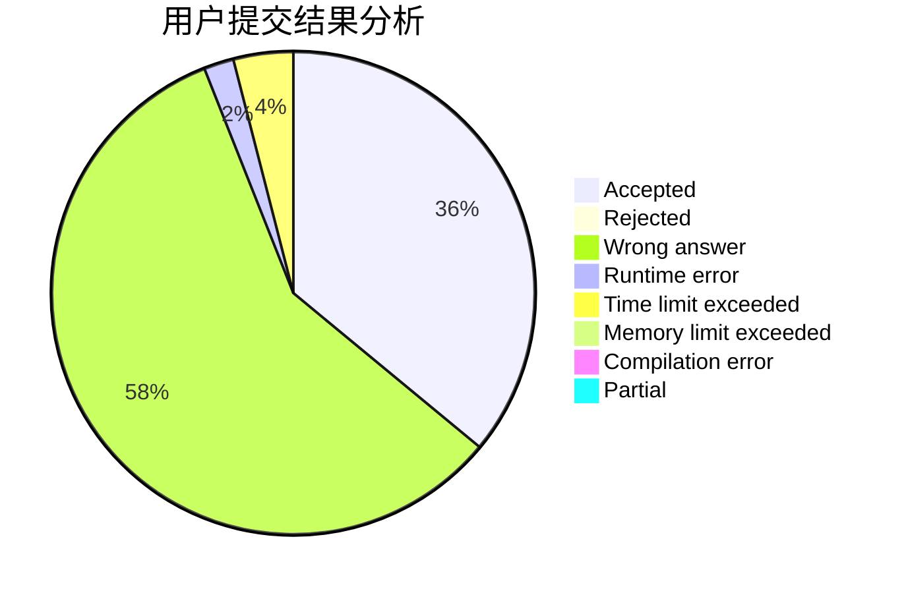
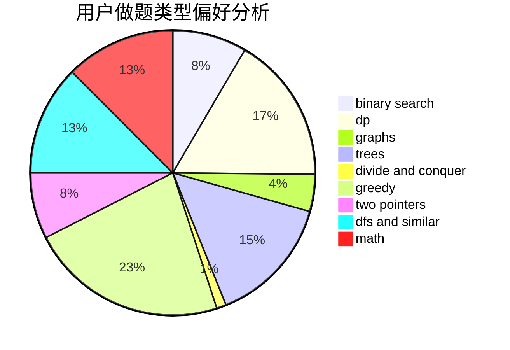

# fanzero

<!-- tabs:start -->

#### **用户提交结果分析**

#### **用户做题类型偏好分析**

<!-- tabs:end -->
# 推荐题目
[615D](https://codeforces.com/contest/615/problem/D)
[381B](https://codeforces.com/contest/381/problem/B)
[1076F](https://codeforces.com/contest/1076/problem/F)
[735C](https://codeforces.com/contest/735/problem/C)
[1183H](https://codeforces.com/contest/1183/problem/H)
[1083B](https://codeforces.com/contest/1083/problem/B)
[544C](https://codeforces.com/contest/544/problem/C)
[95E](https://codeforces.com/contest/95/problem/E)
[490E](https://codeforces.com/contest/490/problem/E)
[800A](https://codeforces.com/contest/800/problem/A)
