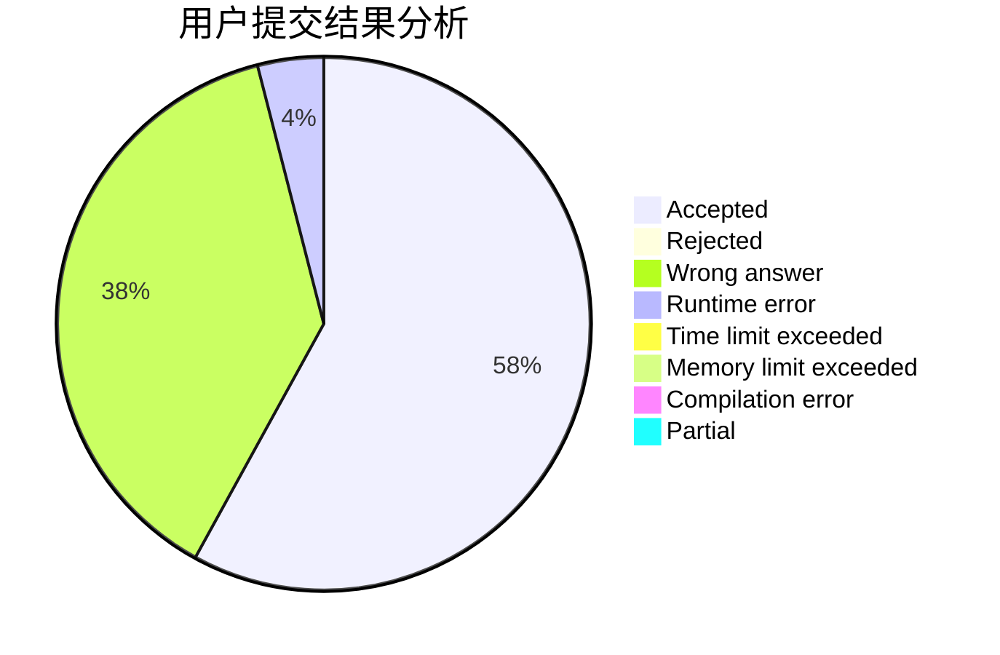
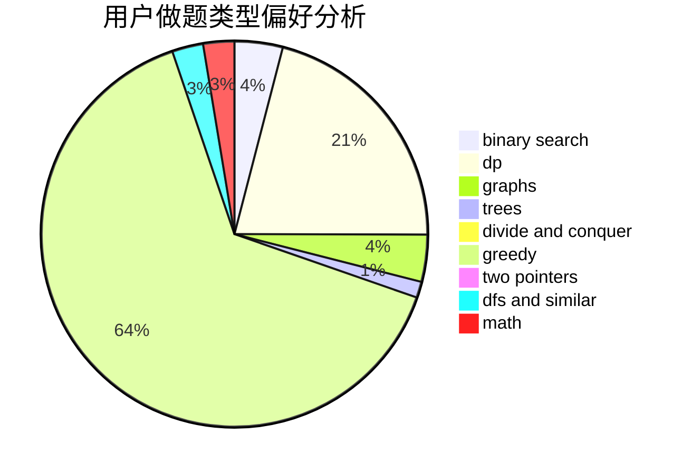

# fastflow

<!-- tabs:start -->

#### **用户提交结果分析**

#### **用户做题类型偏好分析**

<!-- tabs:end -->
# 推荐题目
[1323C](https://codeforces.com/contest/1323/problem/C)
[442B](https://codeforces.com/contest/442/problem/B)
[956D](https://codeforces.com/contest/956/problem/D)
[954I](https://codeforces.com/contest/954/problem/I)
[414B](https://codeforces.com/contest/414/problem/B)
[760A](https://codeforces.com/contest/760/problem/A)
[1146D](https://codeforces.com/contest/1146/problem/D)
[888F](https://codeforces.com/contest/888/problem/F)
[870E](https://codeforces.com/contest/870/problem/E)
[603C](https://codeforces.com/contest/603/problem/C)
