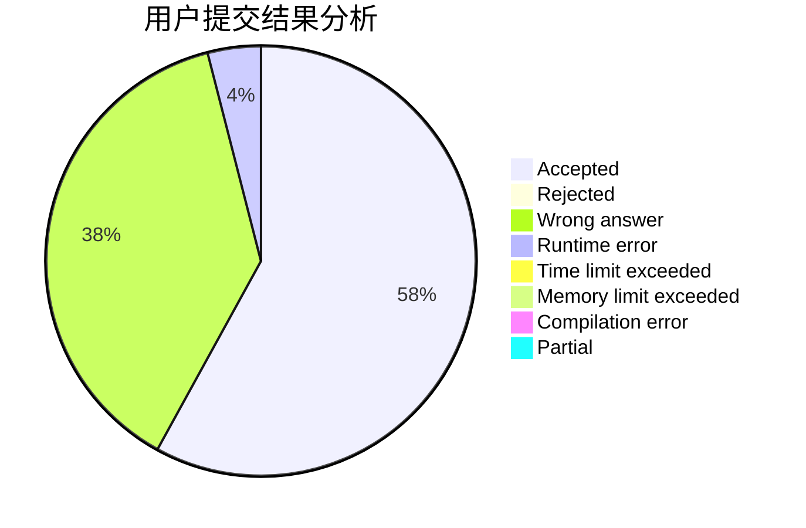
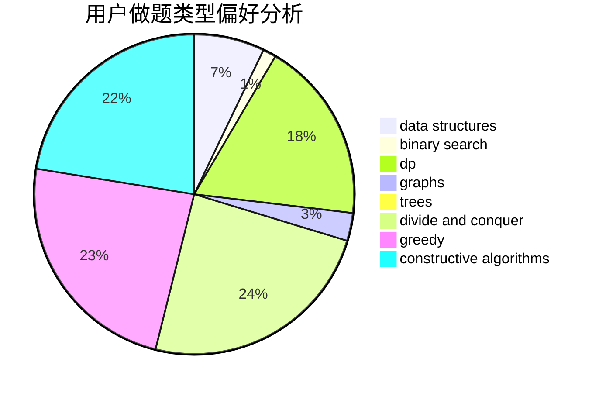

# fastflow

<!-- tabs:start -->

#### **用户提交结果分析**

#### **用户做题类型偏好分析**

#### **用户错题知识点分析**

<!-- tabs:end -->
# 推荐题目
[1313E](https://codeforces.com/contest/1313/problem/E)		data structures,
                        hashing,
                        strings,
                        two pointers		  
[417C](https://codeforces.com/contest/417/problem/C)		constructive algorithms,
                        graphs,
                        implementation		  
[934E](https://codeforces.com/contest/934/problem/E)		dsu,graphs,sortings,trees		  
[932G](https://codeforces.com/contest/932/problem/G)		dp,
                        string suffix structures,
                        strings		  
[383A](https://codeforces.com/contest/383/problem/A)		data structures,
                        greedy		  
[739E](https://codeforces.com/contest/739/problem/E)		brute force,
                        data structures,
                        dp,
                        flows,
                        math,
                        probabilities,
                        sortings		  
[1144C](https://codeforces.com/contest/1144/problem/C)		constructive algorithms,
                        sortings		  
[869C](https://codeforces.com/contest/869/problem/C)		combinatorics,
                        dp,
                        math		  
[852E](https://codeforces.com/contest/852/problem/E)		dp		  
[582C](https://codeforces.com/contest/582/problem/C)		number theory		  
