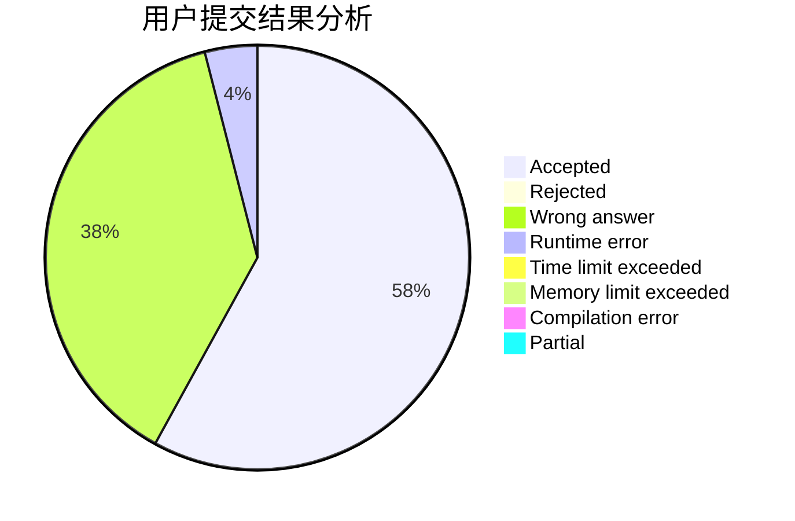
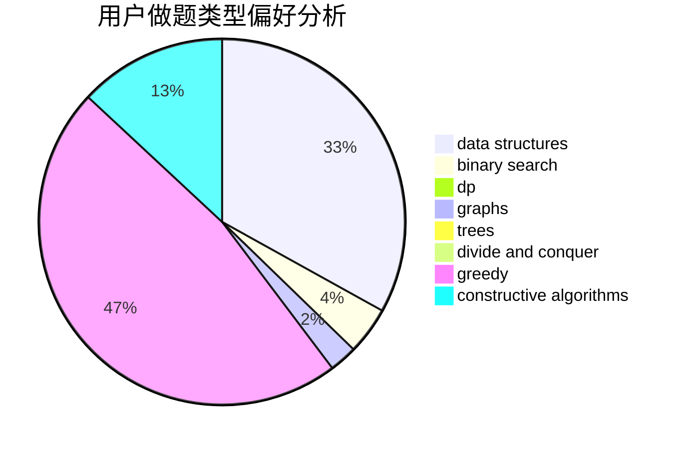

# fastflow

<!-- tabs:start -->

#### **用户提交结果分析**

#### **用户做题类型偏好分析**

#### **用户错题知识点分析**

<!-- tabs:end -->
# 推荐题目
[1323C](https://codeforces.com/contest/1323/problem/C)		dsu,graphs,sortings,trees		  
[442B](https://codeforces.com/contest/442/problem/B)		greedy,
                        math,
                        probabilities		  
[956D](https://codeforces.com/contest/956/problem/D)		dsu,graphs,sortings,trees		  
[954I](https://codeforces.com/contest/954/problem/I)		fft,
                        math		  
[414B](https://codeforces.com/contest/414/problem/B)		combinatorics,
                        dp,
                        number theory		  
[760A](https://codeforces.com/contest/760/problem/A)		implementation,
                        math		  
[1146D](https://codeforces.com/contest/1146/problem/D)		dfs and similar,
                        math,
                        number theory		  
[888F](https://codeforces.com/contest/888/problem/F)		dp,
                        graphs		  
[870E](https://codeforces.com/contest/870/problem/E)		dfs and similar,
                        dsu,
                        graphs,
                        trees		  
[603C](https://codeforces.com/contest/603/problem/C)		games,
                        math		  
