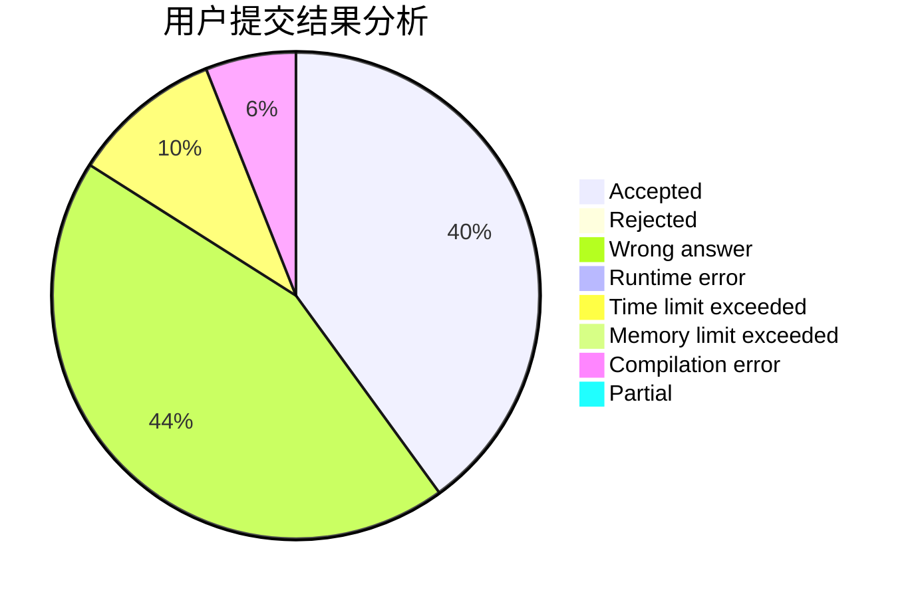
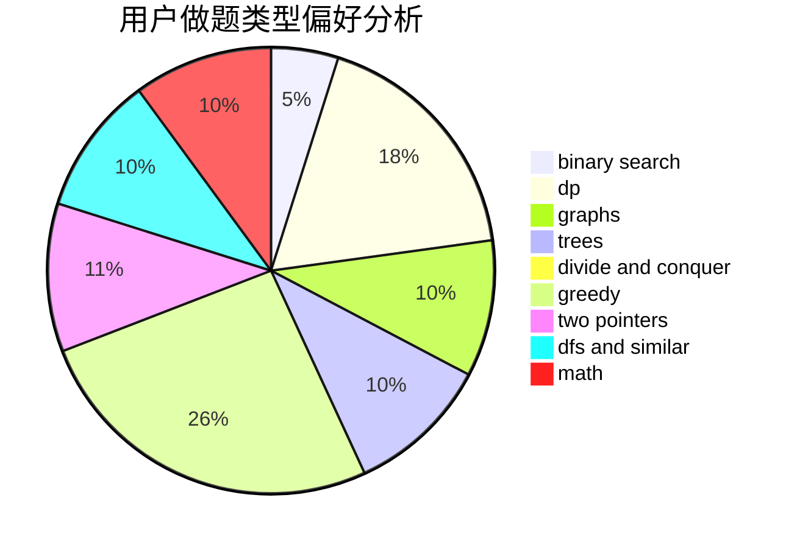

# fczhao

<!-- tabs:start -->

#### **用户提交结果分析**

#### **用户做题类型偏好分析**

<!-- tabs:end -->
# 推荐题目
[869B](https://codeforces.com/contest/869/problem/B)
[1030G](https://codeforces.com/contest/1030/problem/G)
[817B](https://codeforces.com/contest/817/problem/B)
[243D](https://codeforces.com/contest/243/problem/D)
[659A](https://codeforces.com/contest/659/problem/A)
[886F](https://codeforces.com/contest/886/problem/F)
[25C](https://codeforces.com/contest/25/problem/C)
[11882](https://codeforces.com/contest/1188/problem/2)
[44I](https://codeforces.com/contest/44/problem/I)
[845E](https://codeforces.com/contest/845/problem/E)
