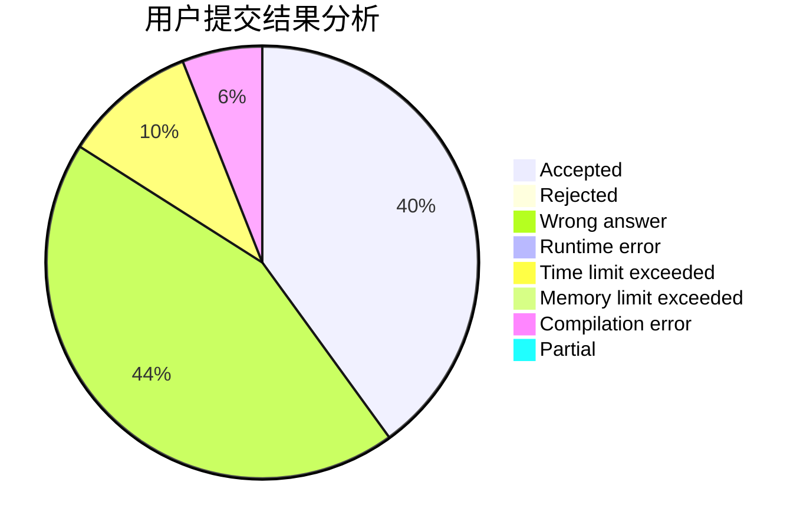
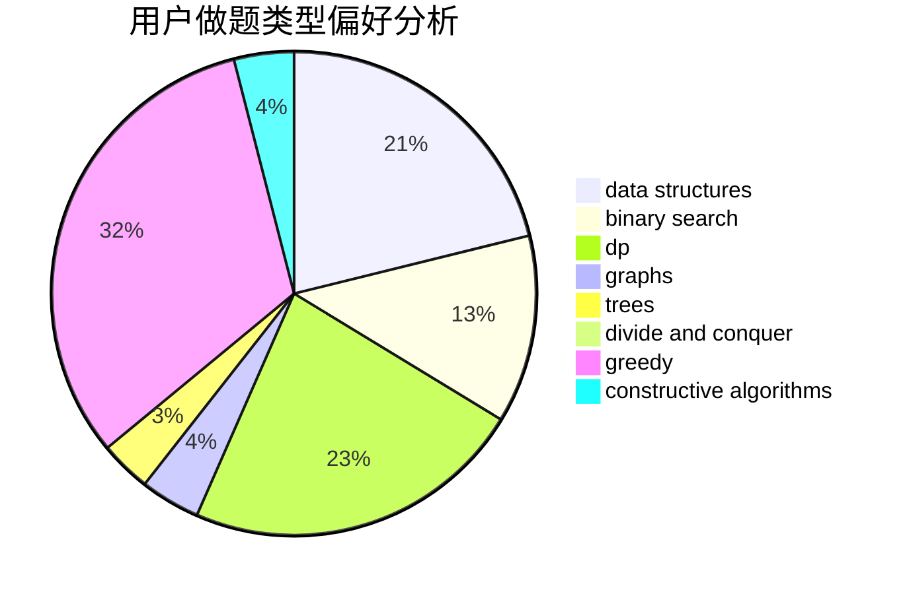
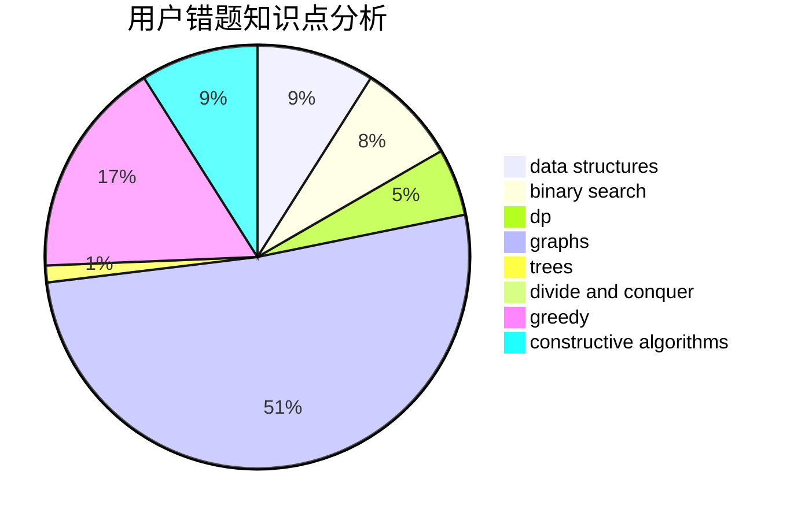

# fczhao

<!-- tabs:start -->

#### **用户提交结果分析**

#### **用户做题类型偏好分析**

#### **用户错题知识点分析**

<!-- tabs:end -->
# 推荐题目
[869B](https://codeforces.com/contest/869/problem/B)		math		  
[1030G](https://codeforces.com/contest/1030/problem/G)		number theory		  
[817B](https://codeforces.com/contest/817/problem/B)		combinatorics,
                        implementation,
                        math,
                        sortings		  
[243D](https://codeforces.com/contest/243/problem/D)		data structures,
                        dp,
                        geometry,
                        two pointers		  
[659A](https://codeforces.com/contest/659/problem/A)		implementation,
                        math		  
[886F](https://codeforces.com/contest/886/problem/F)		geometry		  
[25C](https://codeforces.com/contest/25/problem/C)		graphs,
                        shortest paths		  
[11882](https://codeforces.com/contest/1188/problem/2)		dsu,graphs,sortings,trees		  
[44I](https://codeforces.com/contest/44/problem/I)		brute force,
                        combinatorics		  
[845E](https://codeforces.com/contest/845/problem/E)		binary search,
                        data structures		  
