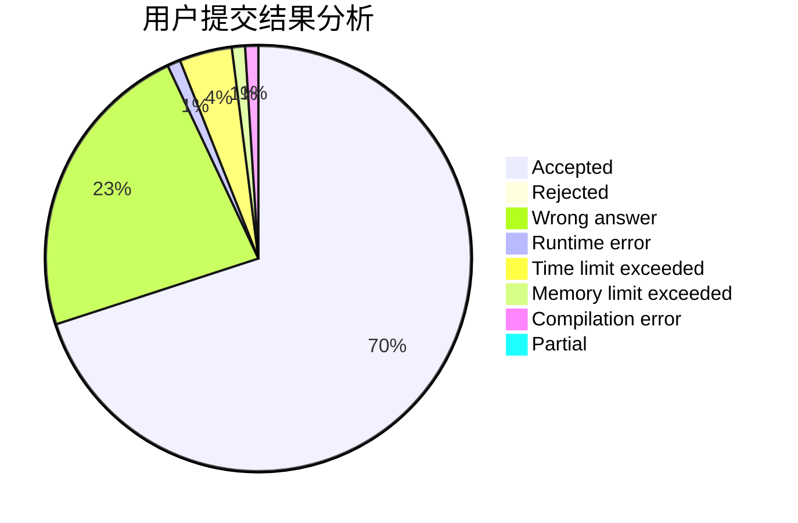
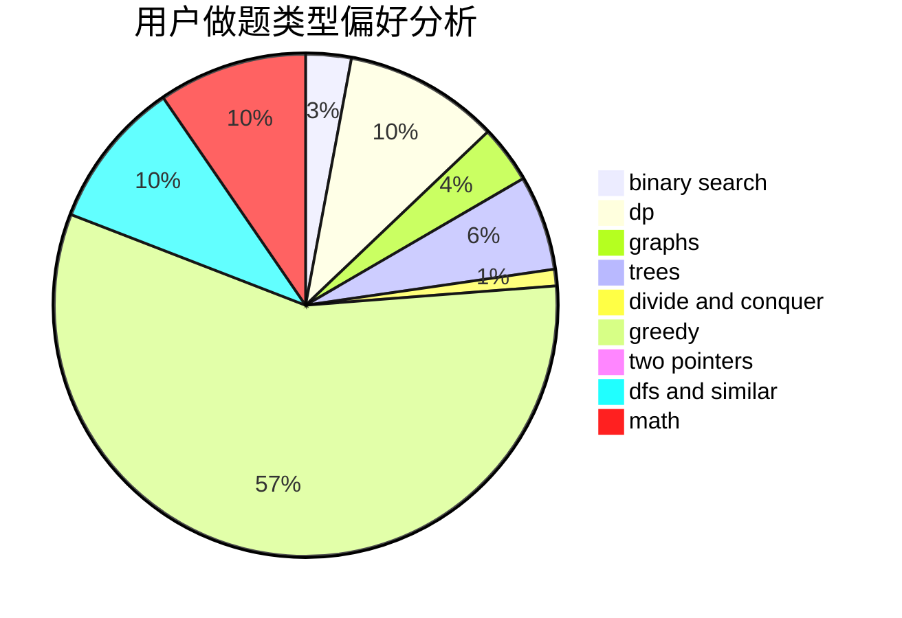

# fdironia

<!-- tabs:start -->

#### **用户提交结果分析**

#### **用户做题类型偏好分析**

<!-- tabs:end -->
# 推荐题目
[708A](https://codeforces.com/contest/708/problem/A)
[1280A](https://codeforces.com/contest/1280/problem/A)
[612A](https://codeforces.com/contest/612/problem/A)
[1393D](https://codeforces.com/contest/1393/problem/D)
[425E](https://codeforces.com/contest/425/problem/E)
[808F](https://codeforces.com/contest/808/problem/F)
[312C](https://codeforces.com/contest/312/problem/C)
[1179B](https://codeforces.com/contest/1179/problem/B)
[232B](https://codeforces.com/contest/232/problem/B)
[984D](https://codeforces.com/contest/984/problem/D)
