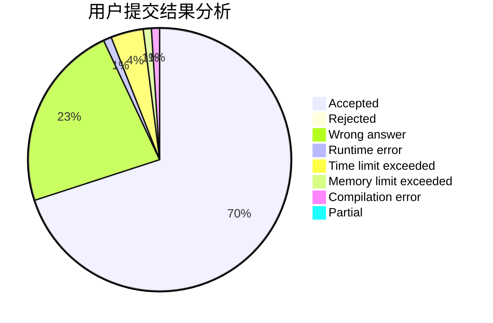
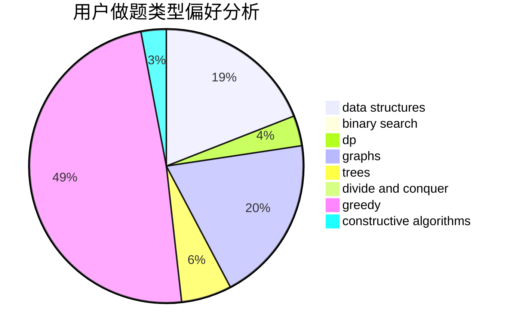

# fdironia

<!-- tabs:start -->

#### **用户提交结果分析**

#### **用户做题类型偏好分析**

#### **用户错题知识点分析**

<!-- tabs:end -->
# 推荐题目
[686A](https://codeforces.com/contest/686/problem/A)		constructive algorithms,
                        implementation		  
[1270H](https://codeforces.com/contest/1270/problem/H)		data structures		  
[593D](https://codeforces.com/contest/593/problem/D)		data structures,
                        dfs and similar,
                        graphs,
                        math,
                        trees		  
[1384A](https://codeforces.com/contest/1384/problem/A)		constructive algorithms,
                        greedy,
                        strings		  
[39C](https://codeforces.com/contest/39/problem/C)		dp,
                        sortings		  
[793D](https://codeforces.com/contest/793/problem/D)		dp,
                        graphs,
                        shortest paths		  
[295E](https://codeforces.com/contest/295/problem/E)		data structures		  
[1176A](https://codeforces.com/contest/1176/problem/A)		brute force,
                        greedy,
                        implementation		  
[212C](https://codeforces.com/contest/212/problem/C)		combinatorics,
                        dp,
                        math		  
[962A](https://codeforces.com/contest/962/problem/A)		implementation		  
