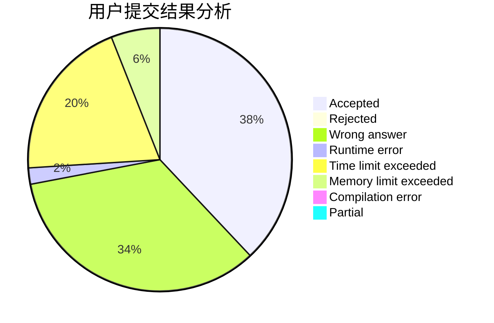
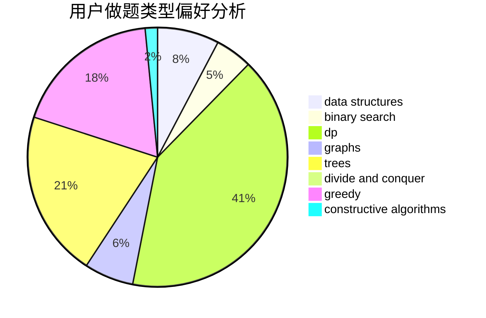
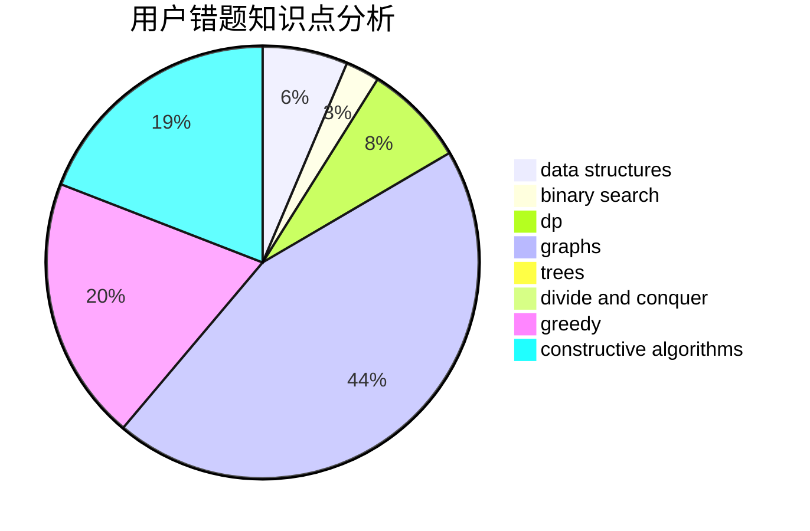

# feifeiko

<!-- tabs:start -->

#### **用户提交结果分析**

#### **用户做题类型偏好分析**

#### **用户错题知识点分析**

<!-- tabs:end -->
# 推荐题目
[1129A2](https://codeforces.com/contest/1129A/problem/2)		brute force,
                        greedy		  
[1133C](https://codeforces.com/contest/1133/problem/C)		sortings,
                        two pointers		  
[363B](https://codeforces.com/contest/363/problem/B)		brute force,
                        dp		  
[1292D](https://codeforces.com/contest/1292/problem/D)		dp,
                        graphs,
                        greedy,
                        math,
                        number theory,
                        trees		  
[875D](https://codeforces.com/contest/875/problem/D)		binary search,
                        bitmasks,
                        combinatorics,
                        data structures,
                        divide and conquer		  
[388E](https://codeforces.com/contest/388/problem/E)		geometry		  
[199D](https://codeforces.com/contest/199/problem/D)		dsu,graphs,sortings,trees		  
[597A](https://codeforces.com/contest/597/problem/A)		math		  
[855F](https://codeforces.com/contest/855/problem/F)		binary search,
                        data structures		  
[957A](https://codeforces.com/contest/957/problem/A)		implementation		  
