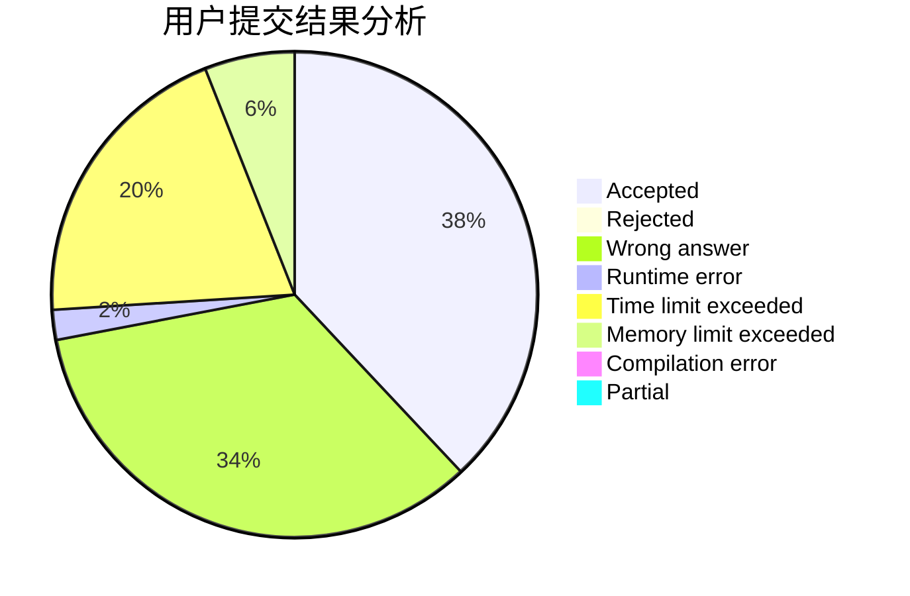
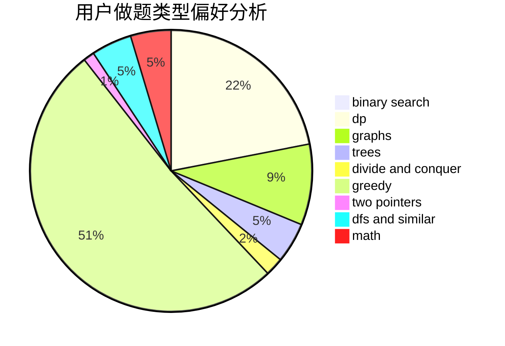

# feifeiko

<!-- tabs:start -->

#### **用户提交结果分析**

#### **用户做题类型偏好分析**

<!-- tabs:end -->
# 推荐题目
[1131A](https://codeforces.com/contest/1131/problem/A)
[1137D](https://codeforces.com/contest/1137/problem/D)
[38A](https://codeforces.com/contest/38/problem/A)
[1299D](https://codeforces.com/contest/1299/problem/D)
[895D](https://codeforces.com/contest/895/problem/D)
[418B](https://codeforces.com/contest/418/problem/B)
[220C](https://codeforces.com/contest/220/problem/C)
[613E](https://codeforces.com/contest/613/problem/E)
[875A](https://codeforces.com/contest/875/problem/A)
[978D](https://codeforces.com/contest/978/problem/D)
