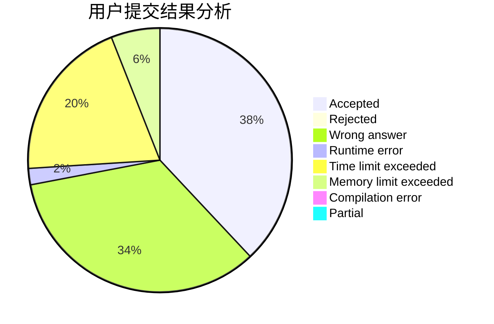
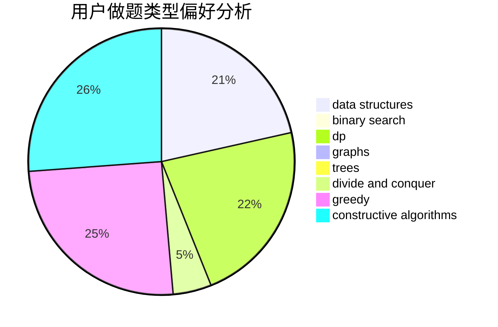
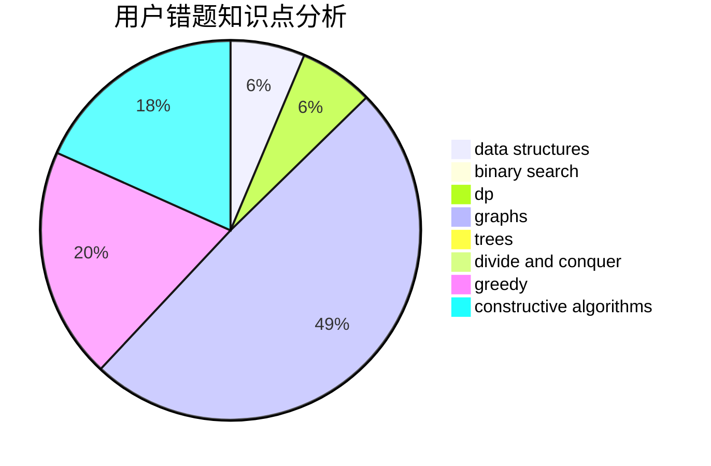

# feifeiko

<!-- tabs:start -->

#### **用户提交结果分析**

#### **用户做题类型偏好分析**

#### **用户错题知识点分析**

<!-- tabs:end -->
# 推荐题目
[1131A](https://codeforces.com/contest/1131/problem/A)		math		  
[1137D](https://codeforces.com/contest/1137/problem/D)		constructive algorithms,
                        interactive,
                        number theory		  
[38A](https://codeforces.com/contest/38/problem/A)		implementation		  
[1299D](https://codeforces.com/contest/1299/problem/D)		bitmasks,
                        combinatorics,
                        dfs and similar,
                        dp,
                        graphs,
                        graphs,
                        math,
                        trees		  
[895D](https://codeforces.com/contest/895/problem/D)		combinatorics,
                        math,
                        strings		  
[418B](https://codeforces.com/contest/418/problem/B)		dsu,graphs,sortings,trees		  
[220C](https://codeforces.com/contest/220/problem/C)		data structures		  
[613E](https://codeforces.com/contest/613/problem/E)		dp,
                        hashing,
                        strings		  
[875A](https://codeforces.com/contest/875/problem/A)		brute force,
                        math		  
[978D](https://codeforces.com/contest/978/problem/D)		brute force,
                        implementation,
                        math		  
