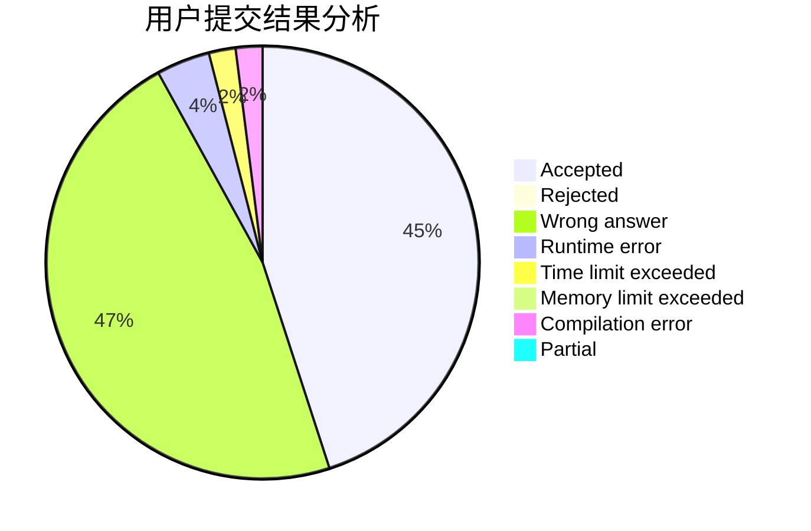
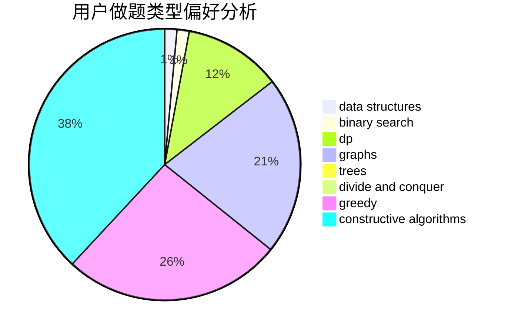

# feiko

<!-- tabs:start -->

#### **用户提交结果分析**

#### **用户做题类型偏好分析**

#### **用户错题知识点分析**

<!-- tabs:end -->
# 推荐题目
[1099C](https://codeforces.com/contest/1099/problem/C)		constructive algorithms,
                        implementation		  
[1440B](https://codeforces.com/contest/1440/problem/B)		greedy,
                        math		  
[134B](https://codeforces.com/contest/134/problem/B)		brute force,
                        dfs and similar,
                        math,
                        number theory		  
[703B](https://codeforces.com/contest/703/problem/B)		implementation,
                        math		  
[1088E](https://codeforces.com/contest/1088/problem/E)		dp,
                        greedy,
                        math,
                        trees		  
[520E](https://codeforces.com/contest/520/problem/E)		combinatorics,
                        dp,
                        math,
                        number theory		  
[975C](https://codeforces.com/contest/975/problem/C)		binary search		  
[523D](https://codeforces.com/contest/523/problem/D)		*special problem,
                        data structures,
                        implementation		  
[731C](https://codeforces.com/contest/731/problem/C)		dfs and similar,
                        dsu,
                        graphs,
                        greedy		  
[884D](https://codeforces.com/contest/884/problem/D)		data structures,
                        greedy		  
