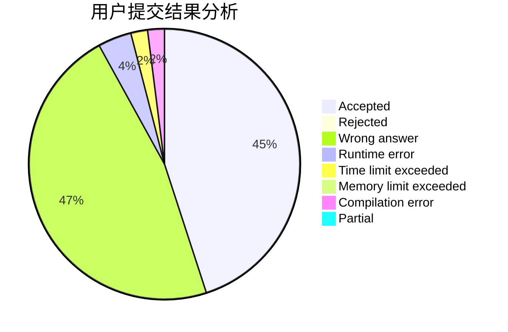
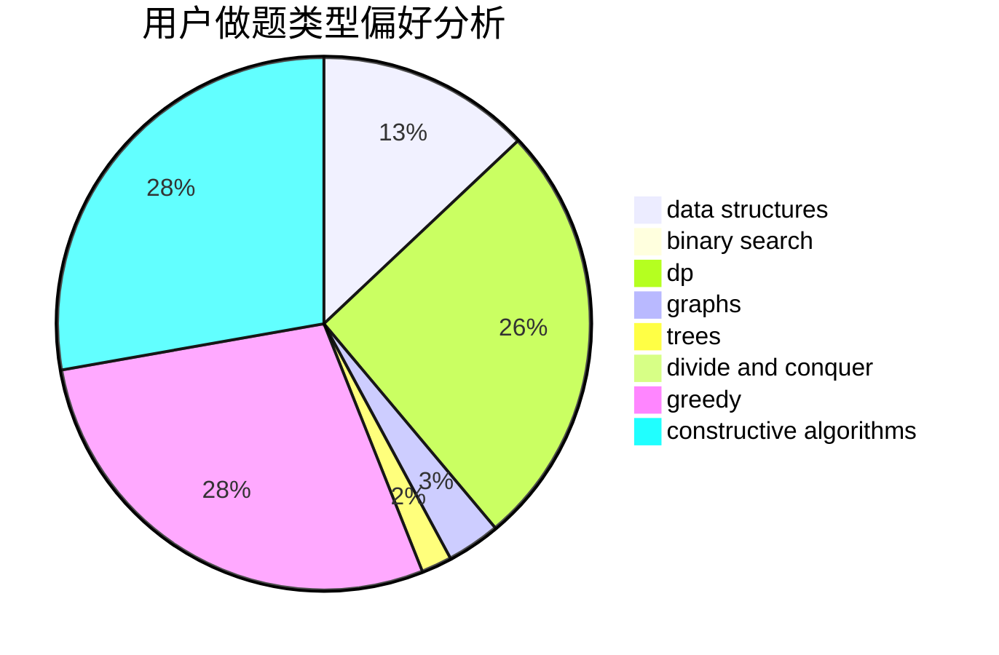

# feiko

<!-- tabs:start -->

#### **用户提交结果分析**

#### **用户做题类型偏好分析**

#### **用户错题知识点分析**

<!-- tabs:end -->
# 推荐题目
[1099F](https://codeforces.com/contest/1099/problem/F)		binary search,
                        data structures,
                        dfs and similar,
                        dp,
                        games,
                        trees		  
[14512](https://codeforces.com/contest/1451/problem/2)		dsu,graphs,sortings,trees		  
[13573](https://codeforces.com/contest/1357/problem/3)		dsu,graphs,sortings,trees		  
[722C](https://codeforces.com/contest/722/problem/C)		data structures,
                        dsu		  
[1089D](https://codeforces.com/contest/1089/problem/D)		graphs		  
[546D](https://codeforces.com/contest/546/problem/D)		constructive algorithms,
                        dp,
                        math,
                        number theory		  
[98B](https://codeforces.com/contest/98/problem/B)		implementation,
                        probabilities,
                        trees		  
[548C](https://codeforces.com/contest/548/problem/C)		dsu,graphs,sortings,trees		  
[749D](https://codeforces.com/contest/749/problem/D)		binary search,
                        data structures		  
[903A](https://codeforces.com/contest/903/problem/A)		greedy,
                        implementation		  
