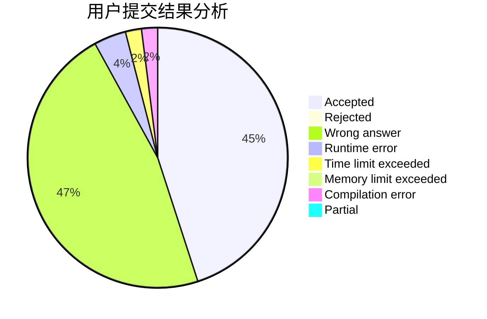
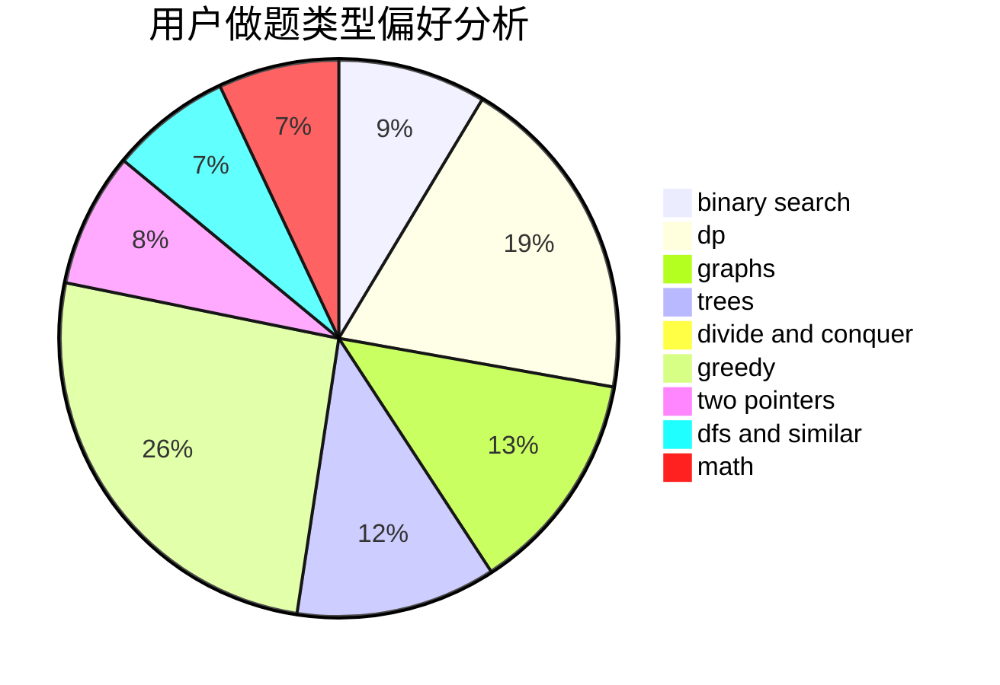

# feiko

<!-- tabs:start -->

#### **用户提交结果分析**

#### **用户做题类型偏好分析**

<!-- tabs:end -->
# 推荐题目
[1099F](https://codeforces.com/contest/1099/problem/F)
[14512](https://codeforces.com/contest/1451/problem/2)
[13573](https://codeforces.com/contest/1357/problem/3)
[722C](https://codeforces.com/contest/722/problem/C)
[1089D](https://codeforces.com/contest/1089/problem/D)
[546D](https://codeforces.com/contest/546/problem/D)
[98B](https://codeforces.com/contest/98/problem/B)
[548C](https://codeforces.com/contest/548/problem/C)
[749D](https://codeforces.com/contest/749/problem/D)
[903A](https://codeforces.com/contest/903/problem/A)
