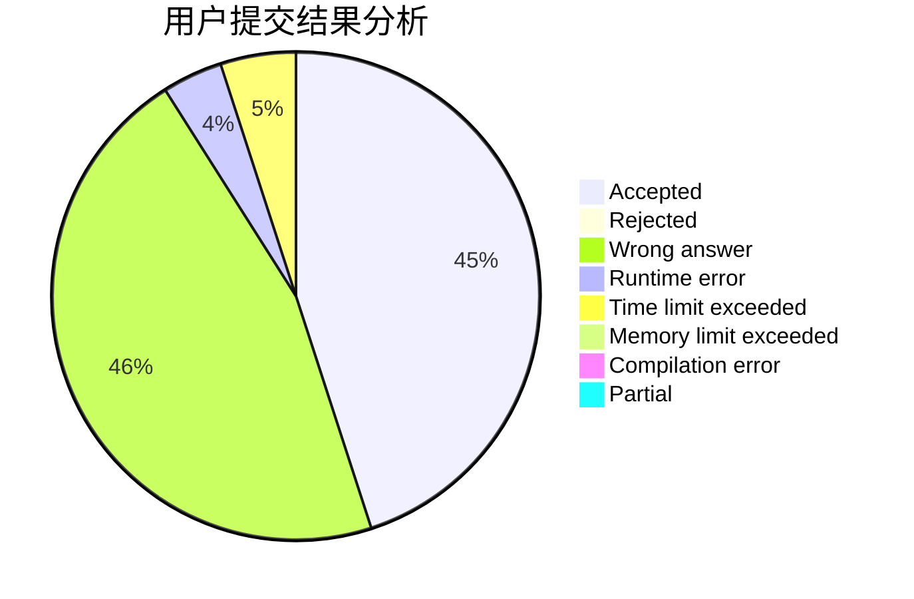
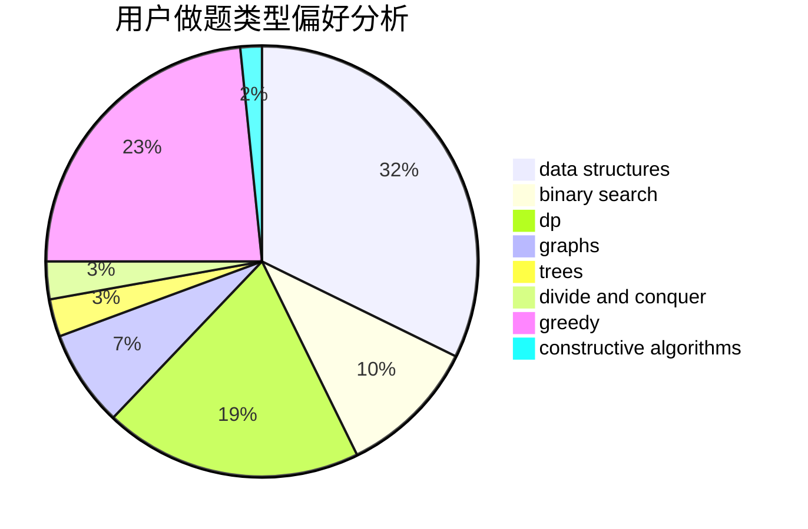
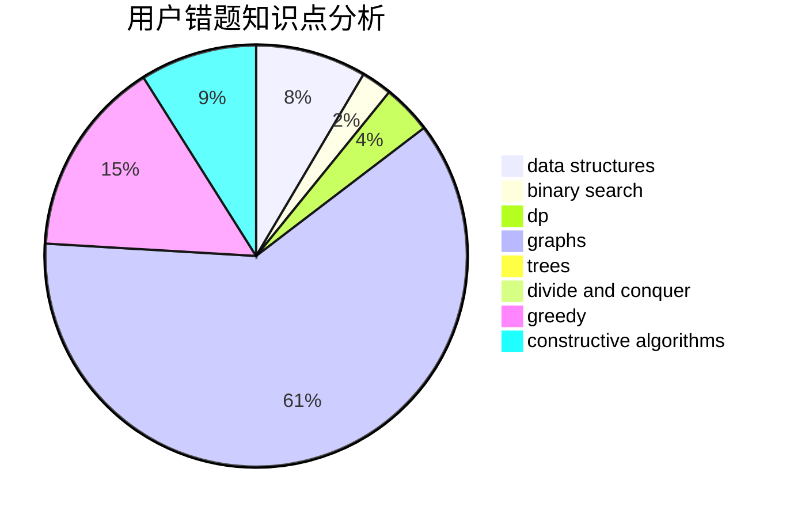

# Asurudo_Jyo

<!-- tabs:start -->

#### **用户提交结果分析**

#### **用户做题类型偏好分析**

#### **用户错题知识点分析**

<!-- tabs:end -->
# 推荐题目
[438B](https://codeforces.com/contest/438/problem/B)		dsu,graphs,sortings,trees		  
[441C](https://codeforces.com/contest/441/problem/C)		constructive algorithms,
                        dfs and similar,
                        implementation		  
[43A](https://codeforces.com/contest/43/problem/A)		strings		  
[1070I](https://codeforces.com/contest/1070/problem/I)		flows,
                        graph matchings,
                        graphs		  
[438E](https://codeforces.com/contest/438/problem/E)		combinatorics,
                        divide and conquer,
                        fft,
                        number theory		  
[1027A](https://codeforces.com/contest/1027/problem/A)		implementation,
                        strings		  
[439D](https://codeforces.com/contest/439/problem/D)		binary search,
                        sortings,
                        ternary search,
                        two pointers		  
[438D](https://codeforces.com/contest/438/problem/D)		data structures,
                        math		  
[306B](https://codeforces.com/contest/306/problem/B)		data structures,
                        greedy,
                        sortings		  
[43E](https://codeforces.com/contest/43/problem/E)		brute force,
                        implementation,
                        two pointers		  
