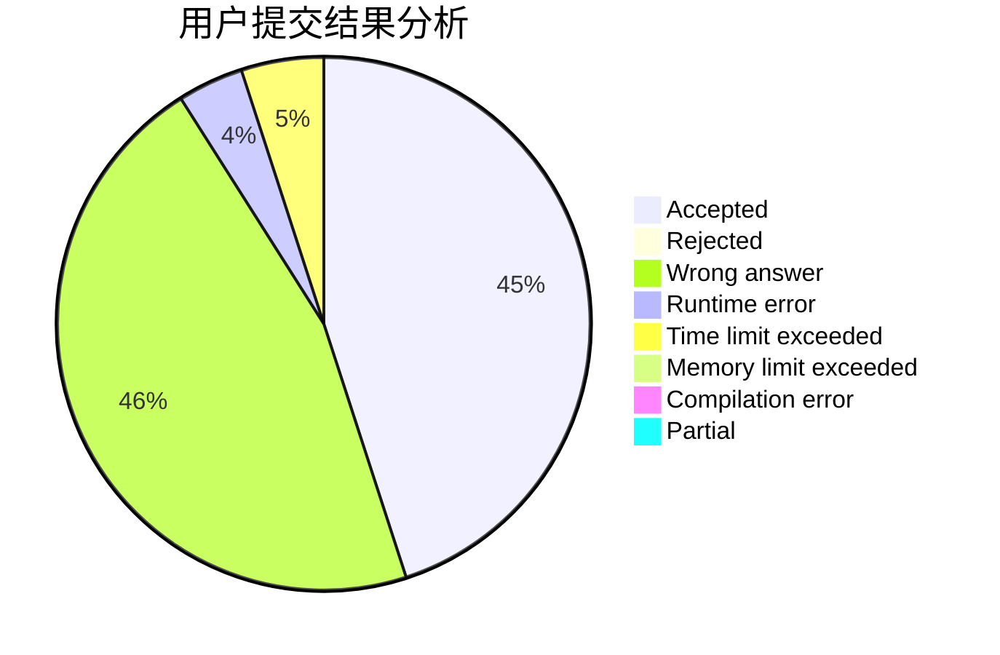
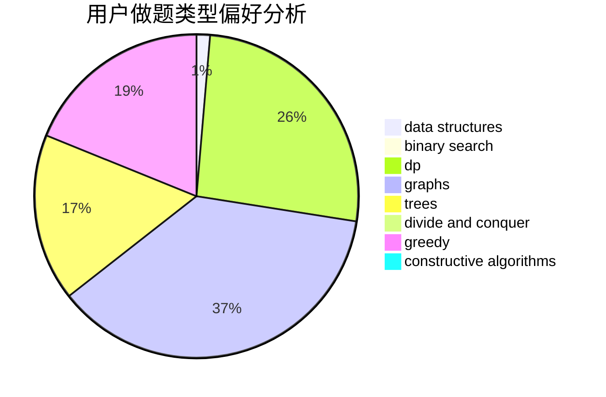
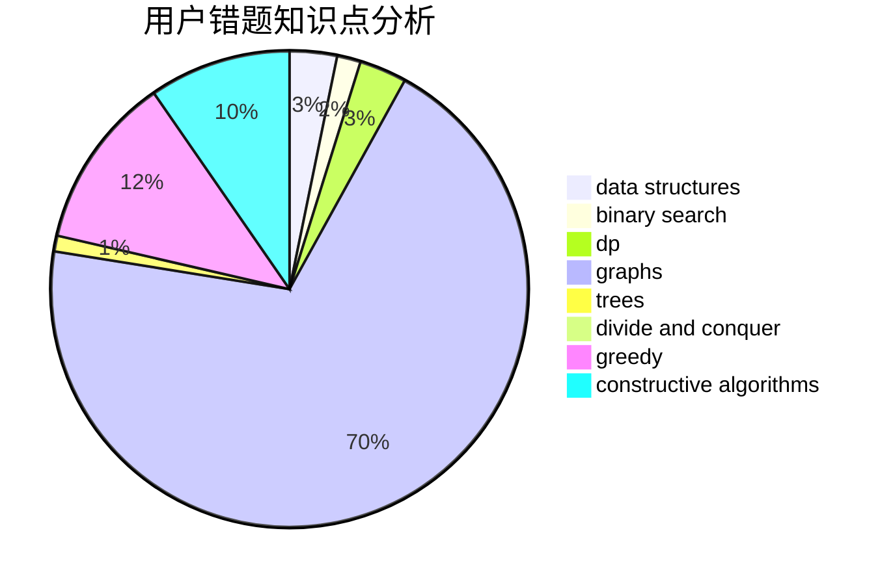

# Asurudo_Jyo

<!-- tabs:start -->

#### **用户提交结果分析**

#### **用户做题类型偏好分析**

#### **用户错题知识点分析**

<!-- tabs:end -->
# 推荐题目
[45G](https://codeforces.com/contest/45/problem/G)		number theory		  
[462A](https://codeforces.com/contest/462/problem/A)		brute force,
                        implementation		  
[461B](https://codeforces.com/contest/461/problem/B)		dfs and similar,
                        dp,
                        trees		  
[1070L](https://codeforces.com/contest/1070/problem/L)		constructive algorithms		  
[460C](https://codeforces.com/contest/460/problem/C)		binary search,
                        data structures,
                        greedy		  
[1027D](https://codeforces.com/contest/1027/problem/D)		dfs and similar,
                        graphs		  
[460E](https://codeforces.com/contest/460/problem/E)		brute force,
                        geometry,
                        math,
                        sortings		  
[460B](https://codeforces.com/contest/460/problem/B)		brute force,
                        implementation,
                        math,
                        number theory		  
[327D](https://codeforces.com/contest/327/problem/D)		constructive algorithms,
                        dfs and similar,
                        graphs		  
[461E](https://codeforces.com/contest/461/problem/E)		binary search,
                        shortest paths,
                        strings		  
