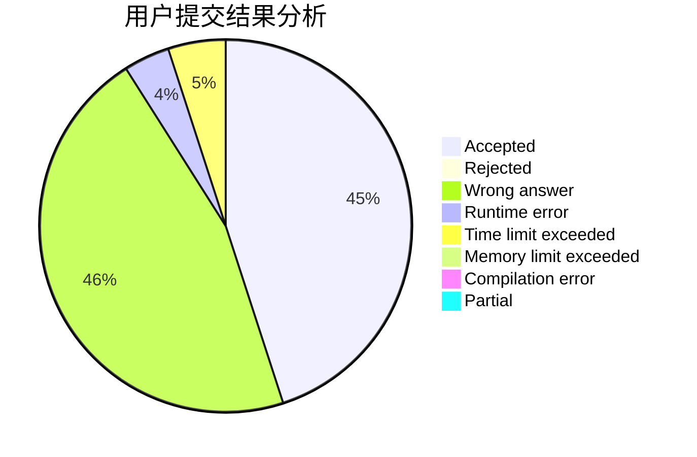
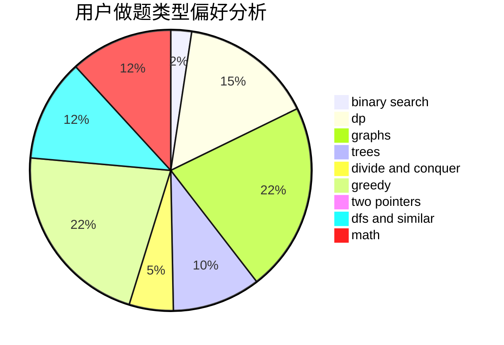

# Asurudo_Jyo

<!-- tabs:start -->

#### **用户提交结果分析**

#### **用户做题类型偏好分析**

<!-- tabs:end -->
# 推荐题目
[45G](https://codeforces.com/contest/45/problem/G)
[462A](https://codeforces.com/contest/462/problem/A)
[461B](https://codeforces.com/contest/461/problem/B)
[1070L](https://codeforces.com/contest/1070/problem/L)
[460C](https://codeforces.com/contest/460/problem/C)
[1027D](https://codeforces.com/contest/1027/problem/D)
[460E](https://codeforces.com/contest/460/problem/E)
[460B](https://codeforces.com/contest/460/problem/B)
[327D](https://codeforces.com/contest/327/problem/D)
[461E](https://codeforces.com/contest/461/problem/E)
