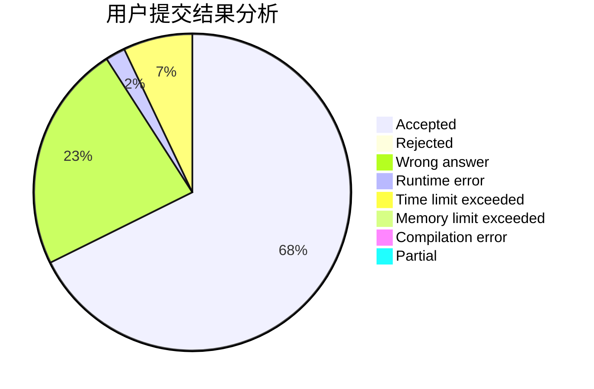
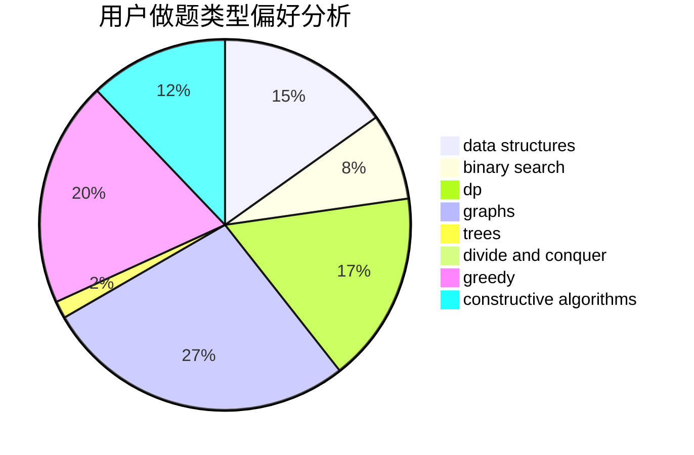
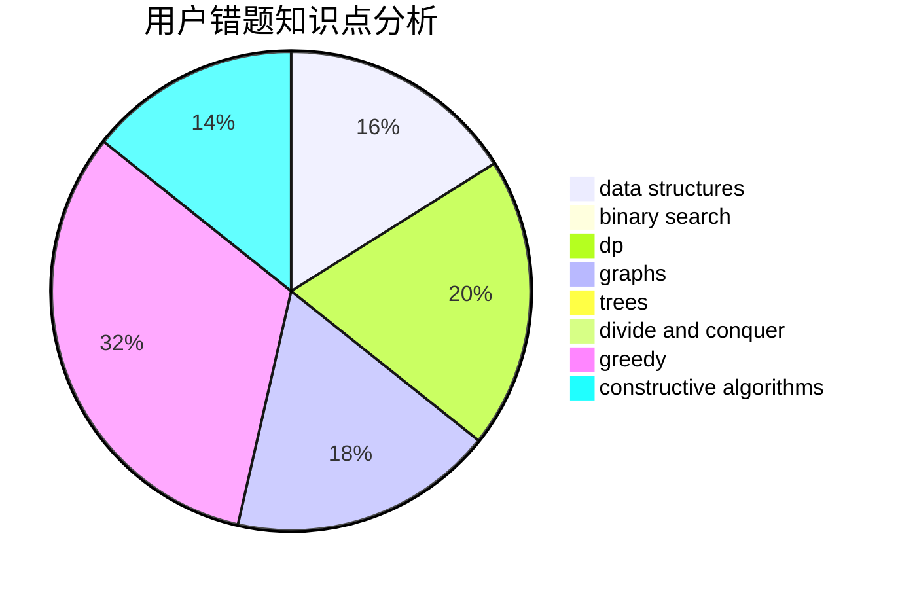

# fengshou

<!-- tabs:start -->

#### **用户提交结果分析**

#### **用户做题类型偏好分析**

#### **用户错题知识点分析**

<!-- tabs:end -->
# 推荐题目
[721E](https://codeforces.com/contest/721/problem/E)		binary search,
                        dp		  
[148E](https://codeforces.com/contest/148/problem/E)		dp		  
[1083B](https://codeforces.com/contest/1083/problem/B)		greedy,
                        strings		  
[1065G](https://codeforces.com/contest/1065/problem/G)		strings		  
[19A](https://codeforces.com/contest/19/problem/A)		implementation		  
[1374F](https://codeforces.com/contest/1374/problem/F)		brute force,
                        constructive algorithms,
                        implementation,
                        sortings		  
[612A](https://codeforces.com/contest/612/problem/A)		brute force,
                        implementation,
                        strings		  
[999C](https://codeforces.com/contest/999/problem/C)		implementation		  
[1015A](https://codeforces.com/contest/1015/problem/A)		implementation		  
[1422D](https://codeforces.com/contest/1422/problem/D)		graphs,
                        shortest paths,
                        sortings		  
