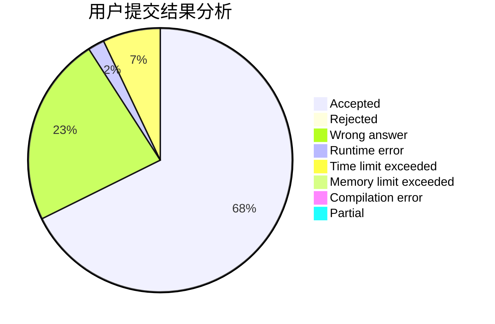
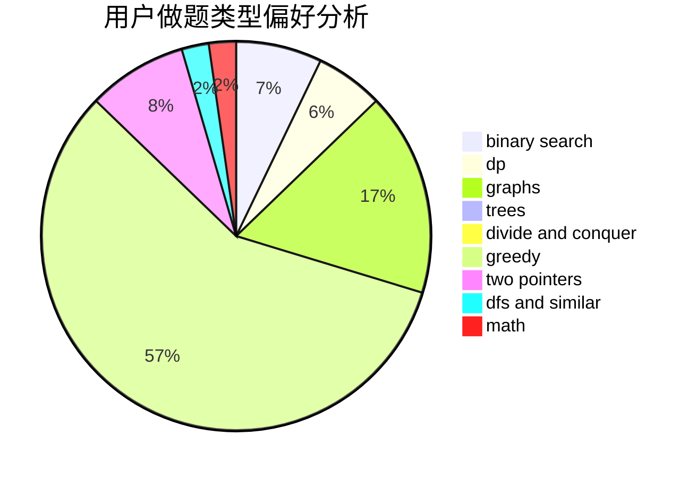

# fengshou

<!-- tabs:start -->

#### **用户提交结果分析**

#### **用户做题类型偏好分析**

<!-- tabs:end -->
# 推荐题目
[721E](https://codeforces.com/contest/721/problem/E)
[148E](https://codeforces.com/contest/148/problem/E)
[1083B](https://codeforces.com/contest/1083/problem/B)
[1065G](https://codeforces.com/contest/1065/problem/G)
[19A](https://codeforces.com/contest/19/problem/A)
[1374F](https://codeforces.com/contest/1374/problem/F)
[612A](https://codeforces.com/contest/612/problem/A)
[999C](https://codeforces.com/contest/999/problem/C)
[1015A](https://codeforces.com/contest/1015/problem/A)
[1422D](https://codeforces.com/contest/1422/problem/D)
