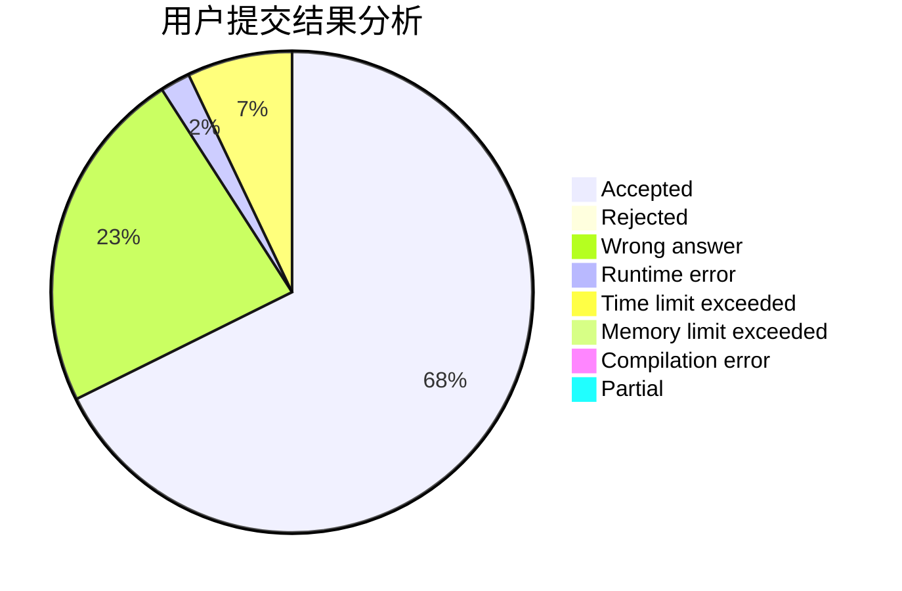
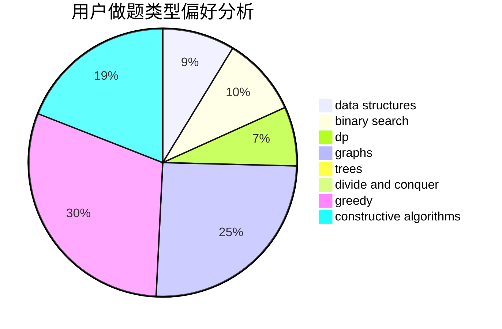
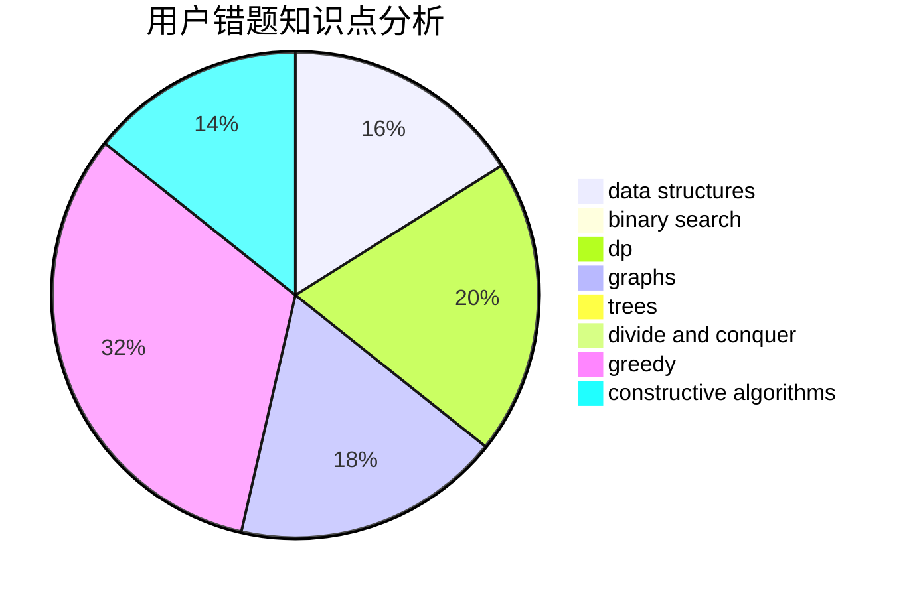

# fengshou

<!-- tabs:start -->

#### **用户提交结果分析**

#### **用户做题类型偏好分析**

#### **用户错题知识点分析**

<!-- tabs:end -->
# 推荐题目
[703A](https://codeforces.com/contest/703/problem/A)		implementation		  
[1482B](https://codeforces.com/contest/1482/problem/B)		implementation,
                        math		  
[1082F](https://codeforces.com/contest/1082/problem/F)		dp,
                        strings,
                        trees		  
[1065C](https://codeforces.com/contest/1065/problem/C)		greedy		  
[171H](https://codeforces.com/contest/171/problem/H)		*special problem,
                        implementation		  
[1368A](https://codeforces.com/contest/1368/problem/A)		brute force,
                        greedy,
                        implementation,
                        math		  
[593D](https://codeforces.com/contest/593/problem/D)		data structures,
                        dfs and similar,
                        graphs,
                        math,
                        trees		  
[983D](https://codeforces.com/contest/983/problem/D)		data structures		  
[1013E](https://codeforces.com/contest/1013/problem/E)		dsu,graphs,sortings,trees		  
[1413B](https://codeforces.com/contest/1413/problem/B)		implementation		  
