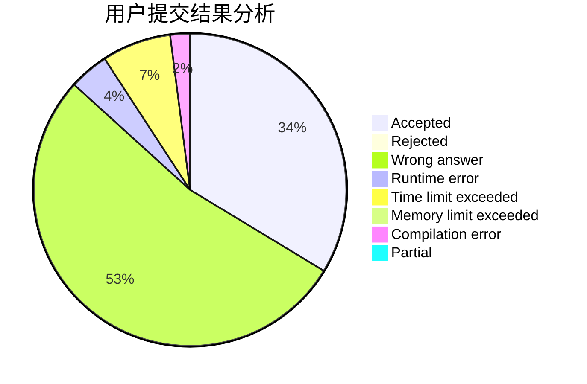
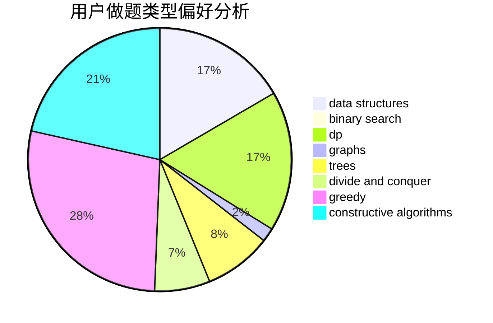
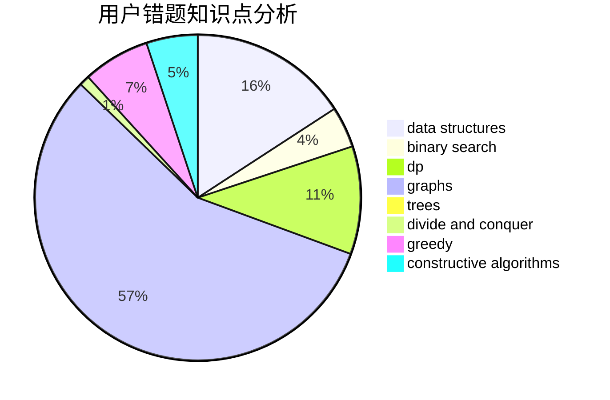

# fengxunling

<!-- tabs:start -->

#### **用户提交结果分析**

#### **用户做题类型偏好分析**

#### **用户错题知识点分析**

<!-- tabs:end -->
# 推荐题目
[1191B](https://codeforces.com/contest/1191/problem/B)		brute force,
                        implementation		  
[1468D](https://codeforces.com/contest/1468/problem/D)		binary search,
                        sortings		  
[1215B](https://codeforces.com/contest/1215/problem/B)		combinatorics,
                        dp,
                        implementation		  
[311A](https://codeforces.com/contest/311/problem/A)		constructive algorithms,
                        implementation		  
[268E](https://codeforces.com/contest/268/problem/E)		math,
                        probabilities,
                        sortings		  
[861C](https://codeforces.com/contest/861/problem/C)		dsu,graphs,sortings,trees		  
[981E](https://codeforces.com/contest/981/problem/E)		bitmasks,
                        data structures,
                        divide and conquer,
                        dp		  
[1121B](https://codeforces.com/contest/1121/problem/B)		brute force,
                        implementation		  
[523A](https://codeforces.com/contest/523/problem/A)		*special problem,
                        implementation		  
[171F](https://codeforces.com/contest/171/problem/F)		*special problem,
                        brute force,
                        implementation,
                        number theory		  
