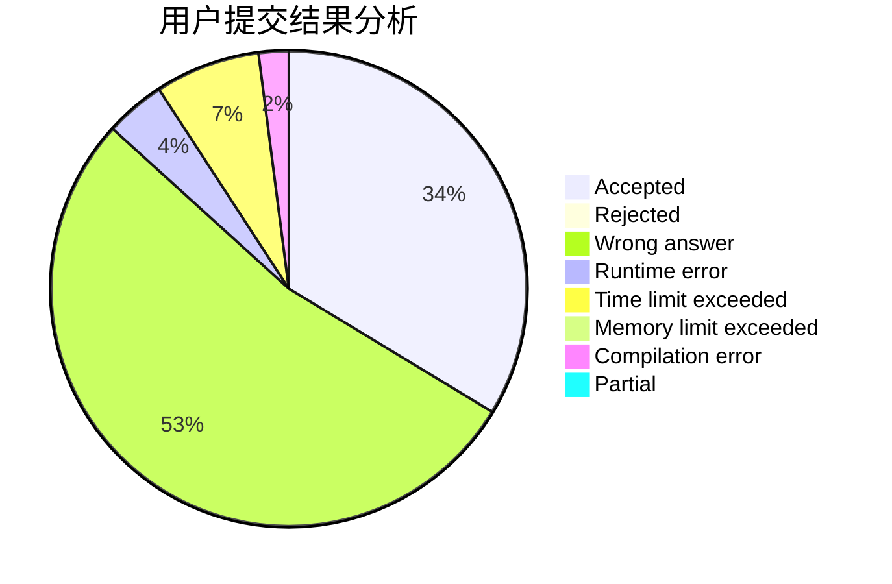
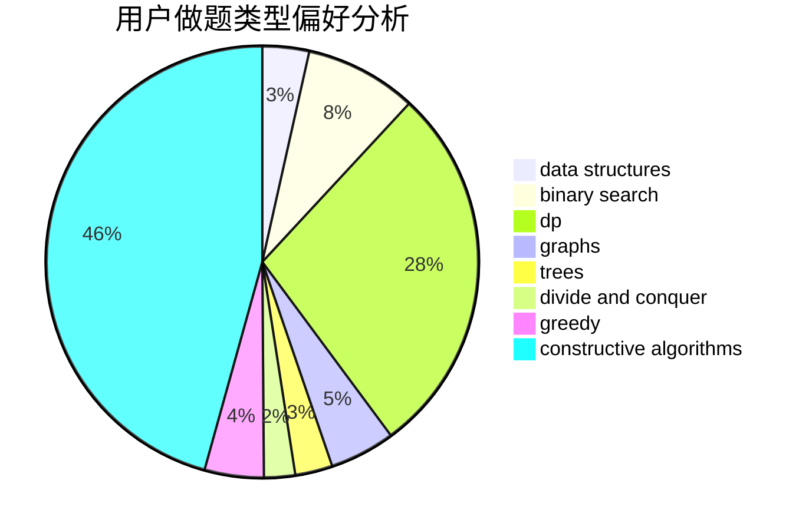
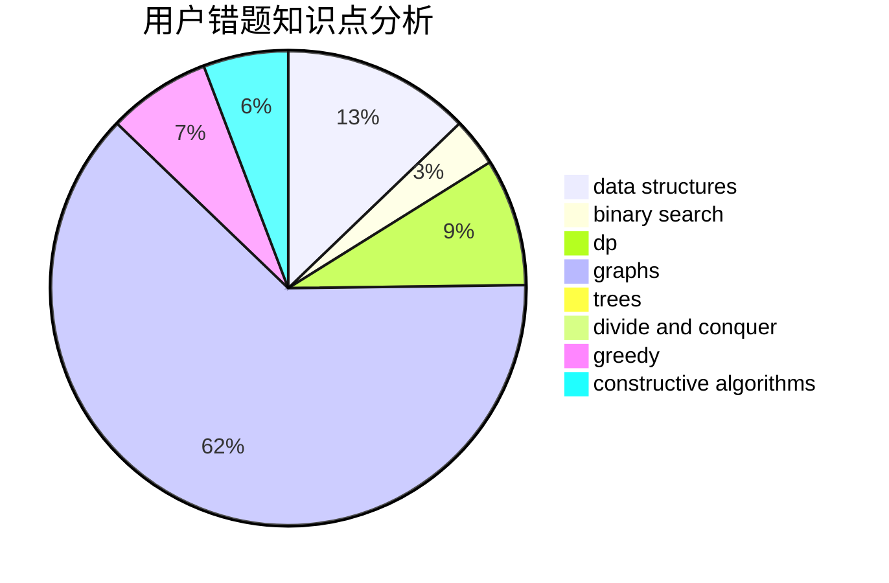

# fengxunling

<!-- tabs:start -->

#### **用户提交结果分析**

#### **用户做题类型偏好分析**

#### **用户错题知识点分析**

<!-- tabs:end -->
# 推荐题目
[1187E](https://codeforces.com/contest/1187/problem/E)		dfs and similar,
                        dp,
                        trees		  
[1459D](https://codeforces.com/contest/1459/problem/D)		dsu,graphs,sortings,trees		  
[1209E2](https://codeforces.com/contest/1209E/problem/2)		bitmasks,
                        dp,
                        greedy,
                        sortings		  
[294D](https://codeforces.com/contest/294/problem/D)		brute force,
                        implementation,
                        number theory		  
[24D](https://codeforces.com/contest/24/problem/D)		dp,
                        math,
                        probabilities		  
[842D](https://codeforces.com/contest/842/problem/D)		binary search,
                        data structures		  
[95A](https://codeforces.com/contest/95/problem/A)		implementation,
                        strings		  
[1119B](https://codeforces.com/contest/1119/problem/B)		binary search,
                        flows,
                        greedy,
                        sortings		  
[501C](https://codeforces.com/contest/501/problem/C)		constructive algorithms,
                        data structures,
                        greedy,
                        sortings,
                        trees		  
[1512F](https://codeforces.com/contest/1512/problem/F)		brute force,
                        dp,
                        greedy,
                        implementation		  
