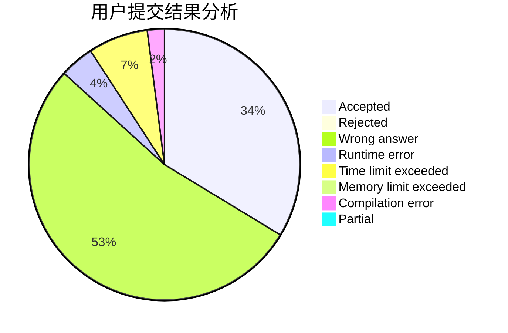
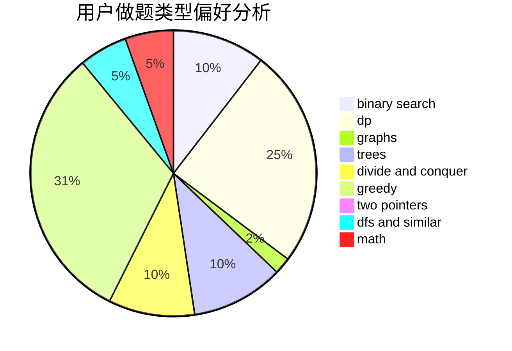

# fengxunling

<!-- tabs:start -->

#### **用户提交结果分析**

#### **用户做题类型偏好分析**

<!-- tabs:end -->
# 推荐题目
[1191B](https://codeforces.com/contest/1191/problem/B)
[1468D](https://codeforces.com/contest/1468/problem/D)
[1215B](https://codeforces.com/contest/1215/problem/B)
[311A](https://codeforces.com/contest/311/problem/A)
[268E](https://codeforces.com/contest/268/problem/E)
[861C](https://codeforces.com/contest/861/problem/C)
[981E](https://codeforces.com/contest/981/problem/E)
[1121B](https://codeforces.com/contest/1121/problem/B)
[523A](https://codeforces.com/contest/523/problem/A)
[171F](https://codeforces.com/contest/171/problem/F)
