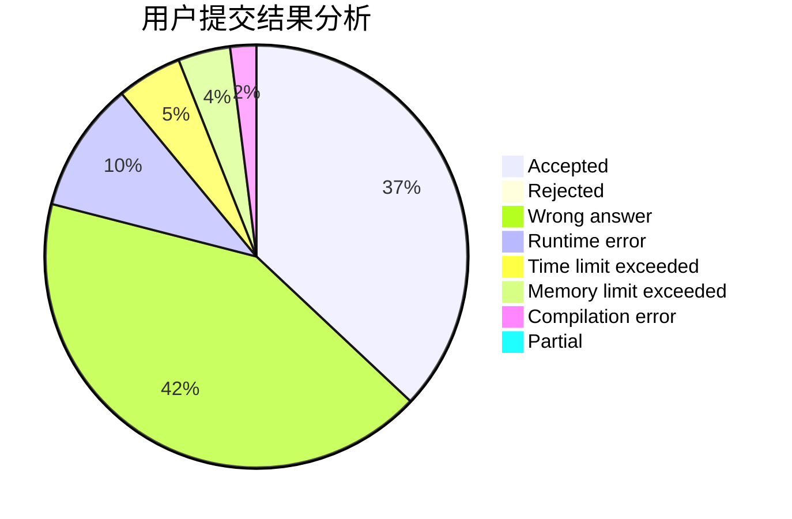
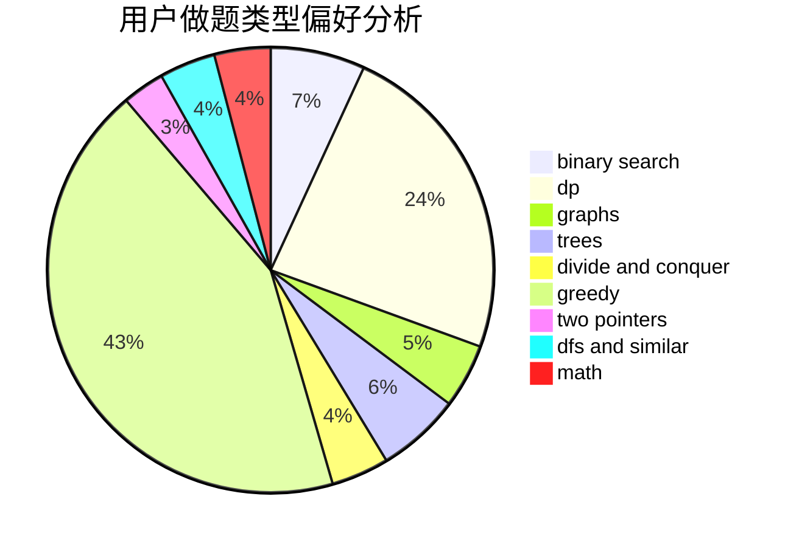

# fengyecong

<!-- tabs:start -->

#### **用户提交结果分析**

#### **用户做题类型偏好分析**

<!-- tabs:end -->
# 推荐题目
[582A](https://codeforces.com/contest/582/problem/A)
[1093B](https://codeforces.com/contest/1093/problem/B)
[429D](https://codeforces.com/contest/429/problem/D)
[36C](https://codeforces.com/contest/36/problem/C)
[1061F](https://codeforces.com/contest/1061/problem/F)
[299C](https://codeforces.com/contest/299/problem/C)
[157C](https://codeforces.com/contest/157/problem/C)
[789C](https://codeforces.com/contest/789/problem/C)
[804D](https://codeforces.com/contest/804/problem/D)
[863E](https://codeforces.com/contest/863/problem/E)
