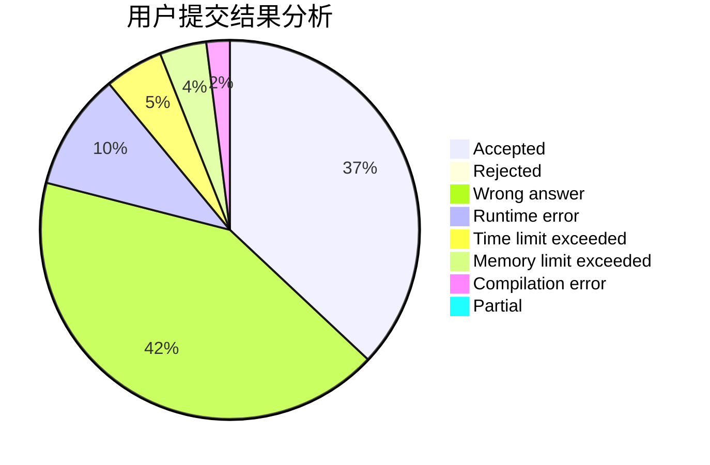
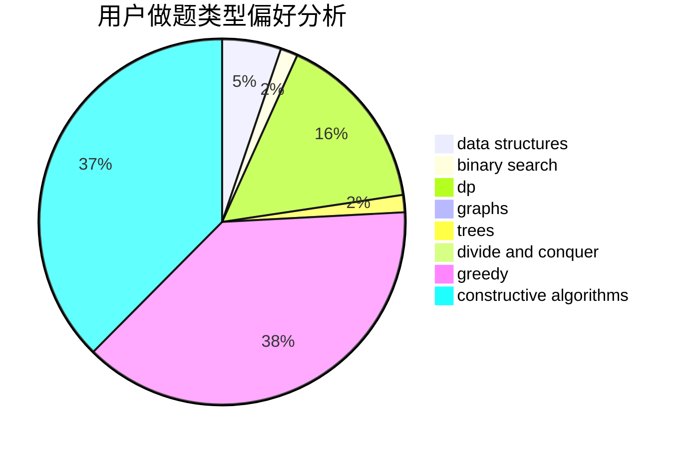
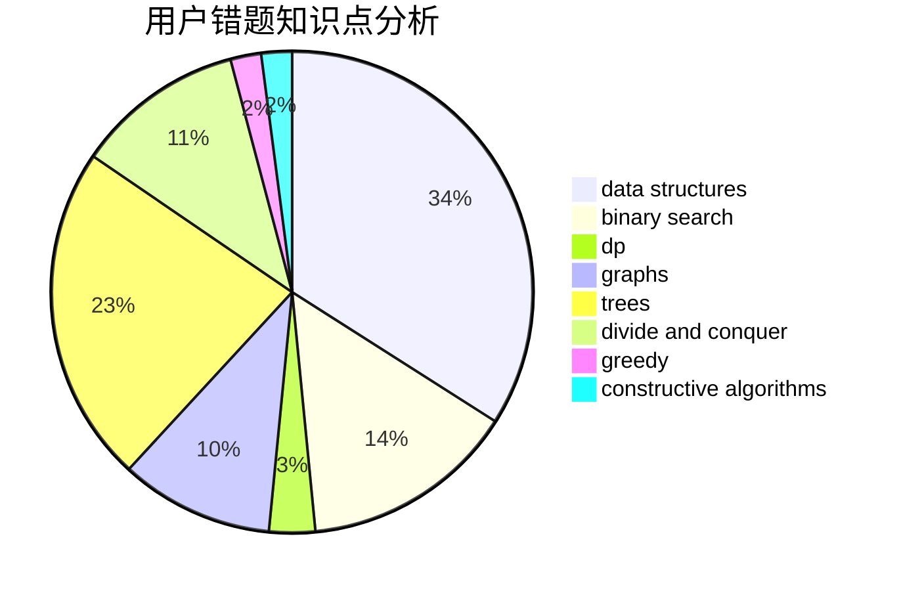

# fengyecong

<!-- tabs:start -->

#### **用户提交结果分析**

#### **用户做题类型偏好分析**

#### **用户错题知识点分析**

<!-- tabs:end -->
# 推荐题目
[582A](https://codeforces.com/contest/582/problem/A)		constructive algorithms,
                        greedy,
                        number theory		  
[1093B](https://codeforces.com/contest/1093/problem/B)		constructive algorithms,
                        greedy,
                        sortings,
                        strings		  
[429D](https://codeforces.com/contest/429/problem/D)		data structures,
                        divide and conquer,
                        geometry		  
[36C](https://codeforces.com/contest/36/problem/C)		geometry,
                        implementation		  
[1061F](https://codeforces.com/contest/1061/problem/F)		interactive,
                        probabilities		  
[299C](https://codeforces.com/contest/299/problem/C)		dsu,graphs,sortings,trees		  
[157C](https://codeforces.com/contest/157/problem/C)		dsu,graphs,sortings,trees		  
[789C](https://codeforces.com/contest/789/problem/C)		dsu,graphs,sortings,trees		  
[804D](https://codeforces.com/contest/804/problem/D)		binary search,
                        brute force,
                        dfs and similar,
                        dp,
                        sortings,
                        trees		  
[863E](https://codeforces.com/contest/863/problem/E)		data structures,
                        sortings		  
