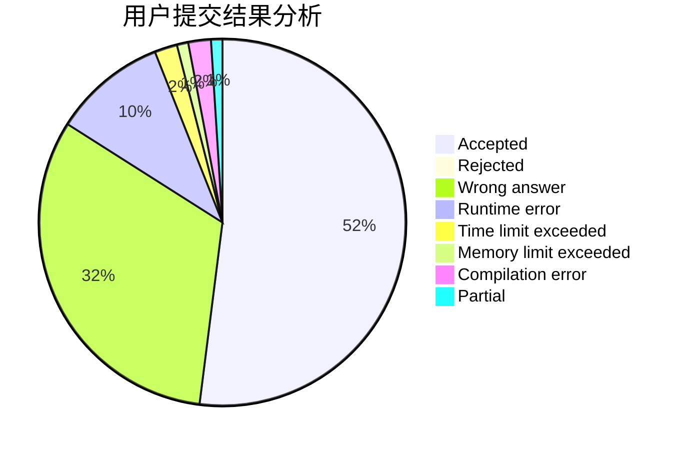
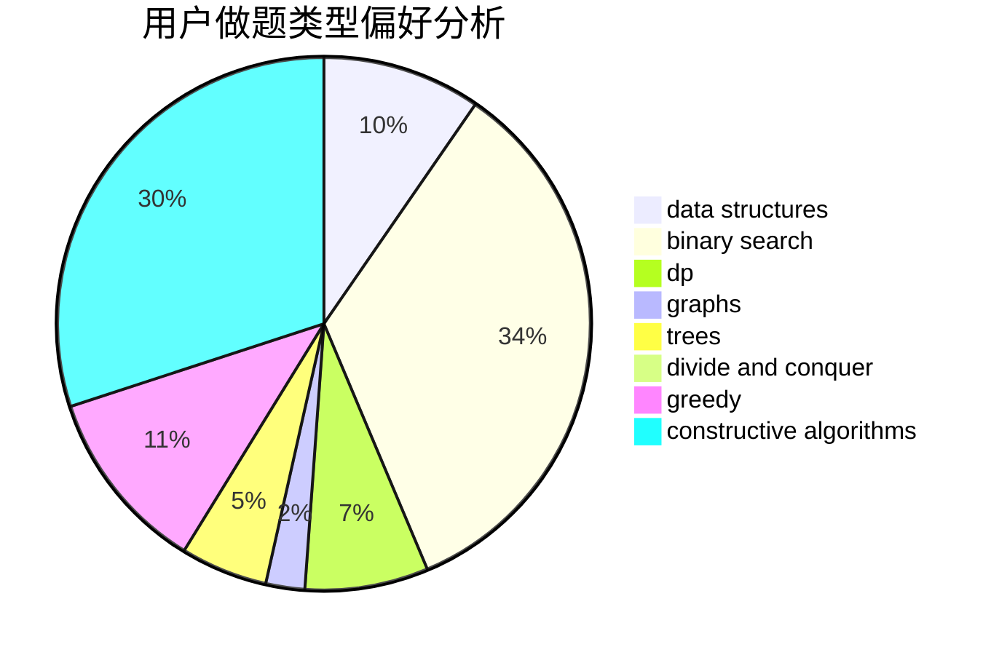
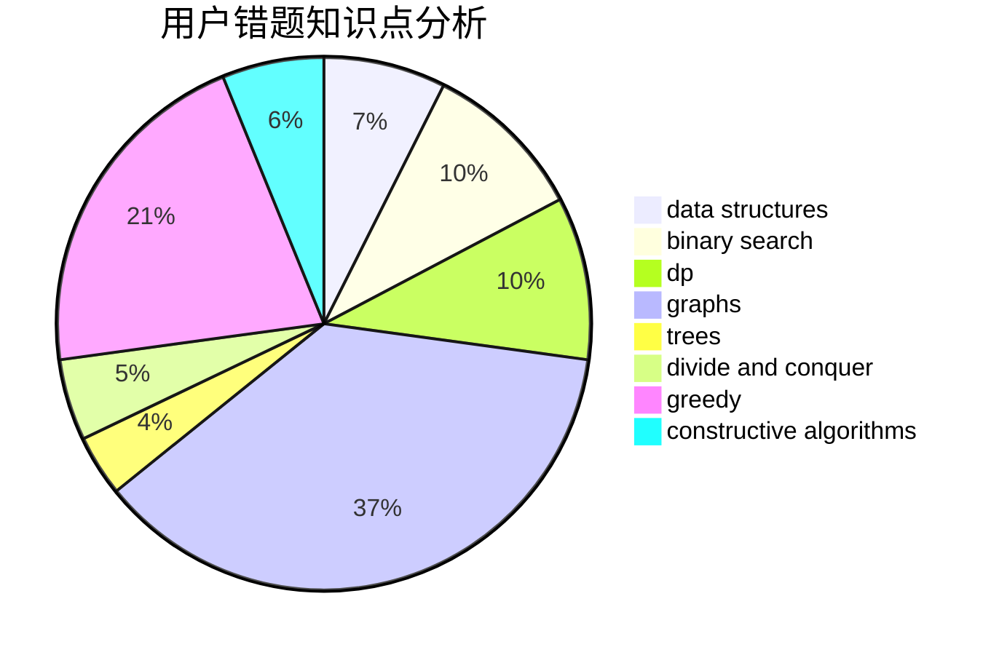

# fengzhengwei

<!-- tabs:start -->

#### **用户提交结果分析**

#### **用户做题类型偏好分析**

#### **用户错题知识点分析**

<!-- tabs:end -->
# 推荐题目
[567E](https://codeforces.com/contest/567/problem/E)		dfs and similar,
                        graphs,
                        hashing,
                        shortest paths		  
[371C](https://codeforces.com/contest/371/problem/C)		binary search,
                        brute force		  
[14472](https://codeforces.com/contest/1447/problem/2)		dsu,graphs,sortings,trees		  
[1182A](https://codeforces.com/contest/1182/problem/A)		dp,
                        math		  
[1140A](https://codeforces.com/contest/1140/problem/A)		implementation		  
[1281E](https://codeforces.com/contest/1281/problem/E)		dsu,graphs,sortings,trees		  
[747F](https://codeforces.com/contest/747/problem/F)		brute force,
                        combinatorics,
                        dp,
                        math		  
[1101G](https://codeforces.com/contest/1101/problem/G)		math,
                        matrices		  
[550C](https://codeforces.com/contest/550/problem/C)		brute force,
                        dp,
                        math		  
[1140G](https://codeforces.com/contest/1140/problem/G)		data structures,
                        divide and conquer,
                        shortest paths,
                        trees		  
