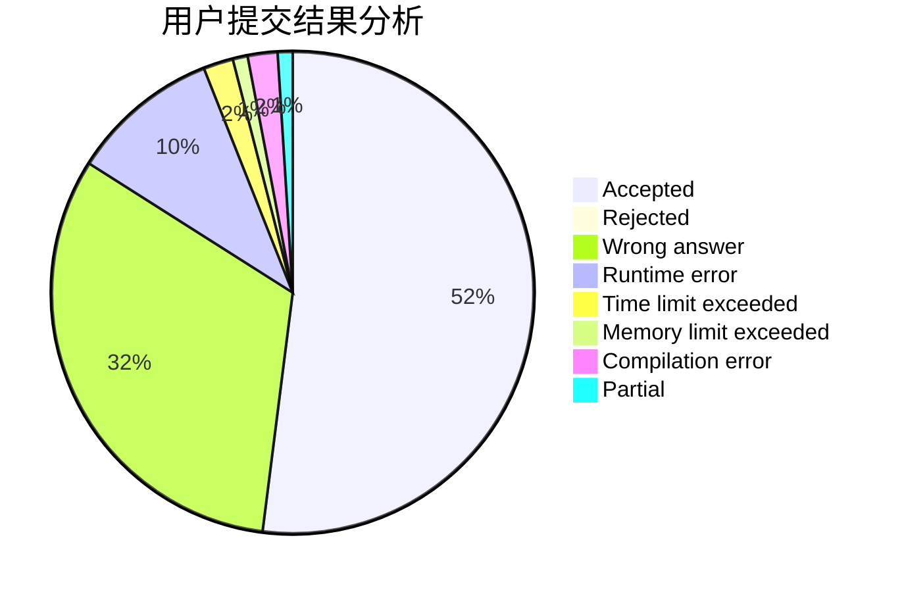
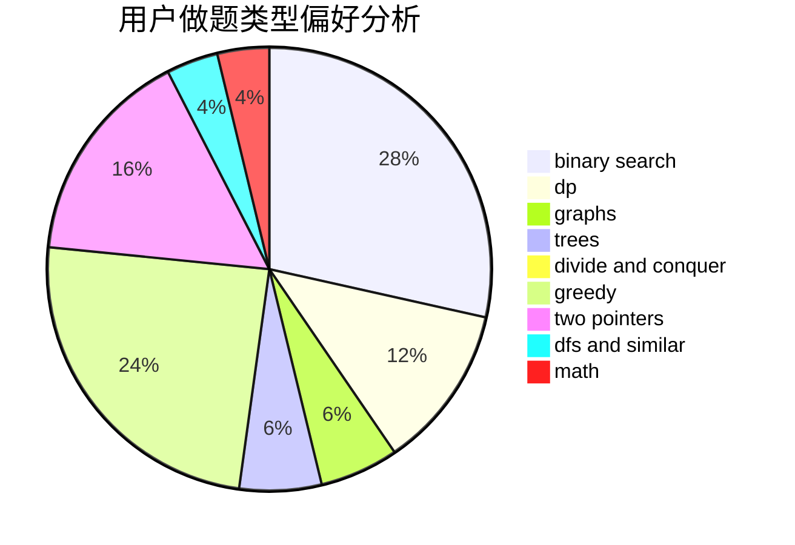

# fengzhengwei

<!-- tabs:start -->

#### **用户提交结果分析**

#### **用户做题类型偏好分析**

<!-- tabs:end -->
# 推荐题目
[567E](https://codeforces.com/contest/567/problem/E)
[371C](https://codeforces.com/contest/371/problem/C)
[14472](https://codeforces.com/contest/1447/problem/2)
[1182A](https://codeforces.com/contest/1182/problem/A)
[1140A](https://codeforces.com/contest/1140/problem/A)
[1281E](https://codeforces.com/contest/1281/problem/E)
[747F](https://codeforces.com/contest/747/problem/F)
[1101G](https://codeforces.com/contest/1101/problem/G)
[550C](https://codeforces.com/contest/550/problem/C)
[1140G](https://codeforces.com/contest/1140/problem/G)
