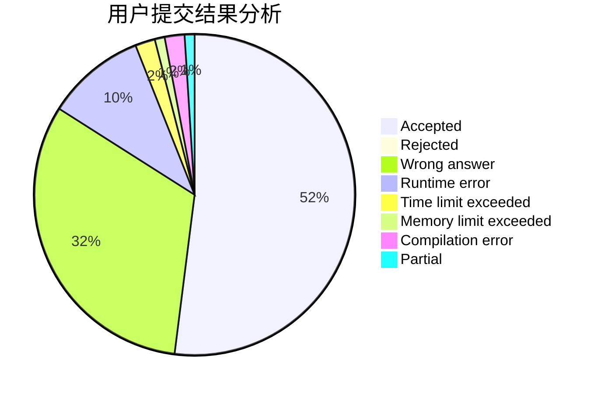
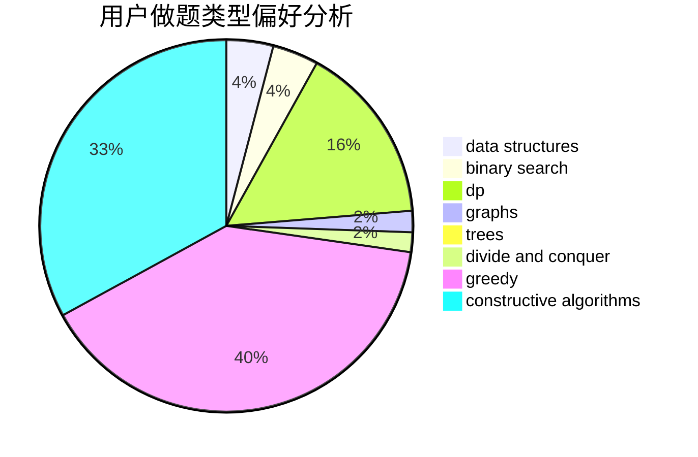
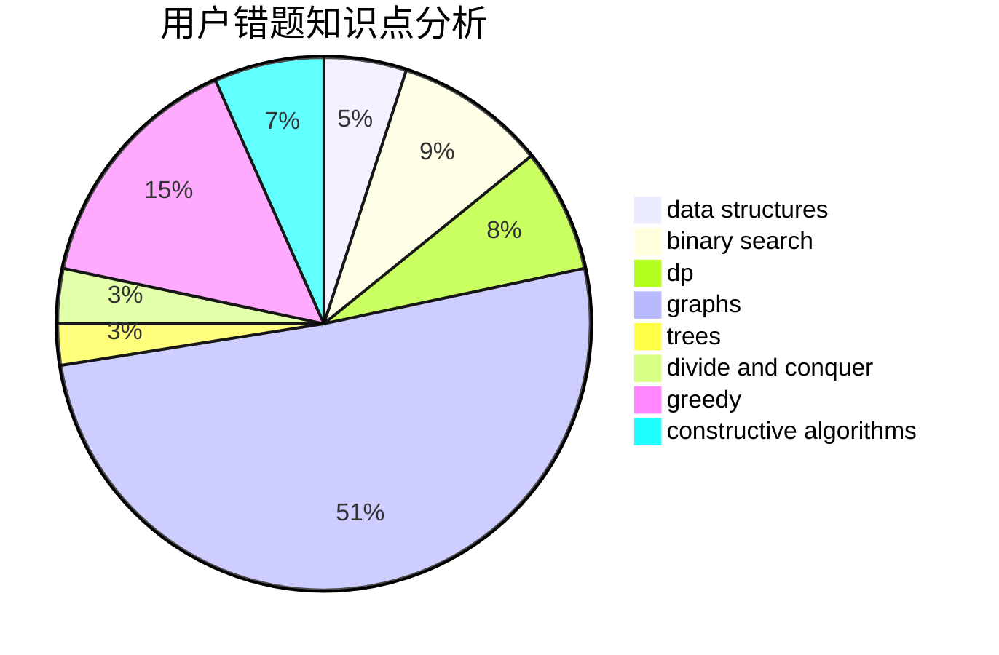

# fengzhengwei

<!-- tabs:start -->

#### **用户提交结果分析**

#### **用户做题类型偏好分析**

#### **用户错题知识点分析**

<!-- tabs:end -->
# 推荐题目
[543C](https://codeforces.com/contest/543/problem/C)		bitmasks,
                        dp		  
[345A](https://codeforces.com/contest/345/problem/A)		*special problem,
                        probabilities		  
[1437C](https://codeforces.com/contest/1437/problem/C)		dp,
                        flows,
                        graph matchings,
                        greedy,
                        math,
                        sortings		  
[1179B](https://codeforces.com/contest/1179/problem/B)		constructive algorithms		  
[1138C](https://codeforces.com/contest/1138/problem/C)		dsu,graphs,sortings,trees		  
[1272C](https://codeforces.com/contest/1272/problem/C)		combinatorics,
                        dp,
                        implementation		  
[730G](https://codeforces.com/contest/730/problem/G)		implementation		  
[1101D](https://codeforces.com/contest/1101/problem/D)		data structures,
                        dfs and similar,
                        dp,
                        number theory,
                        trees		  
[526D](https://codeforces.com/contest/526/problem/D)		hashing,
                        string suffix structures,
                        strings		  
[1139C](https://codeforces.com/contest/1139/problem/C)		dfs and similar,
                        dsu,
                        graphs,
                        math,
                        trees		  
