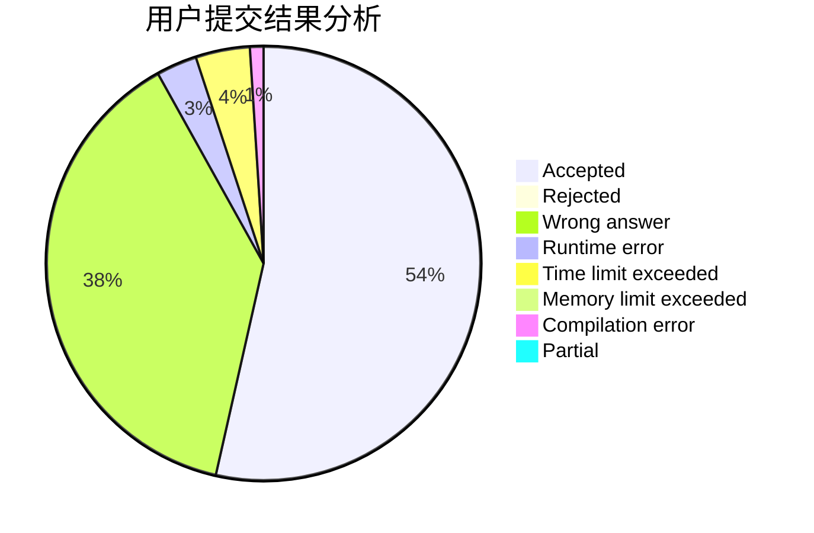
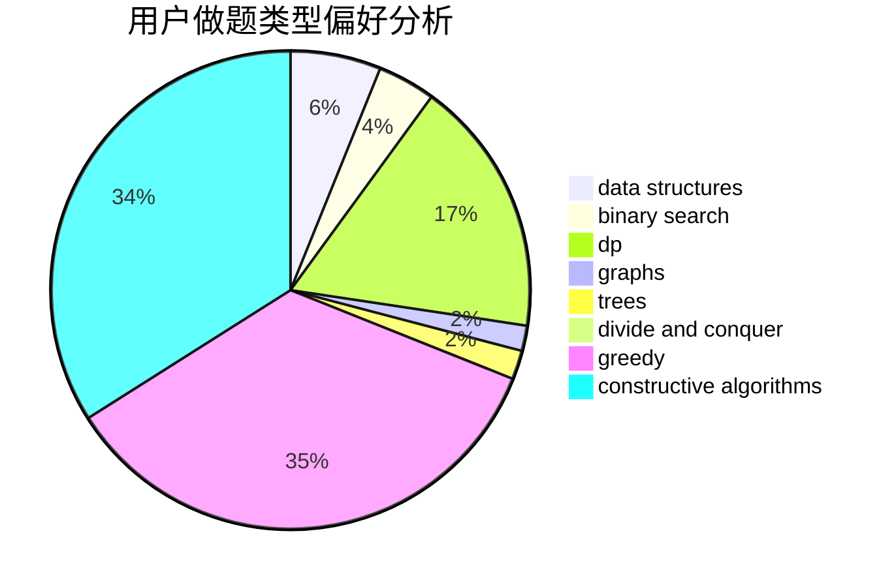
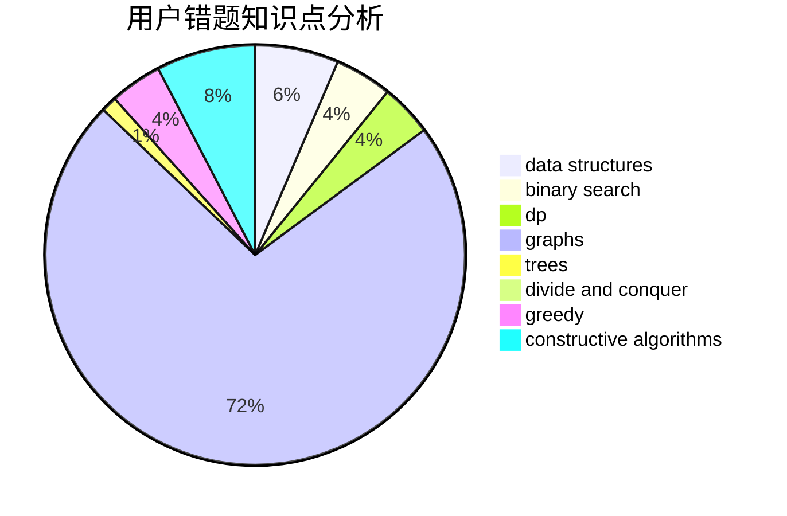

# ferrari430

<!-- tabs:start -->

#### **用户提交结果分析**

#### **用户做题类型偏好分析**

#### **用户错题知识点分析**

<!-- tabs:end -->
# 推荐题目
[917A](https://codeforces.com/contest/917/problem/A)		dp,
                        greedy,
                        implementation,
                        math		  
[1367C](https://codeforces.com/contest/1367/problem/C)		constructive algorithms,
                        greedy,
                        math		  
[1153C](https://codeforces.com/contest/1153/problem/C)		greedy,
                        strings		  
[1141D](https://codeforces.com/contest/1141/problem/D)		greedy,
                        implementation		  
[219D](https://codeforces.com/contest/219/problem/D)		dfs and similar,
                        dp,
                        graphs,
                        trees		  
[1066F](https://codeforces.com/contest/1066/problem/F)		dp		  
[1488B](https://codeforces.com/contest/1488/problem/B)		*special problem,
                        greedy		  
[1129C](https://codeforces.com/contest/1129/problem/C)		binary search,
                        data structures,
                        dp,
                        hashing,
                        sortings,
                        string suffix structures,
                        strings		  
[343B](https://codeforces.com/contest/343/problem/B)		data structures,
                        greedy,
                        implementation		  
[1246F](https://codeforces.com/contest/1246/problem/F)		nan		  
