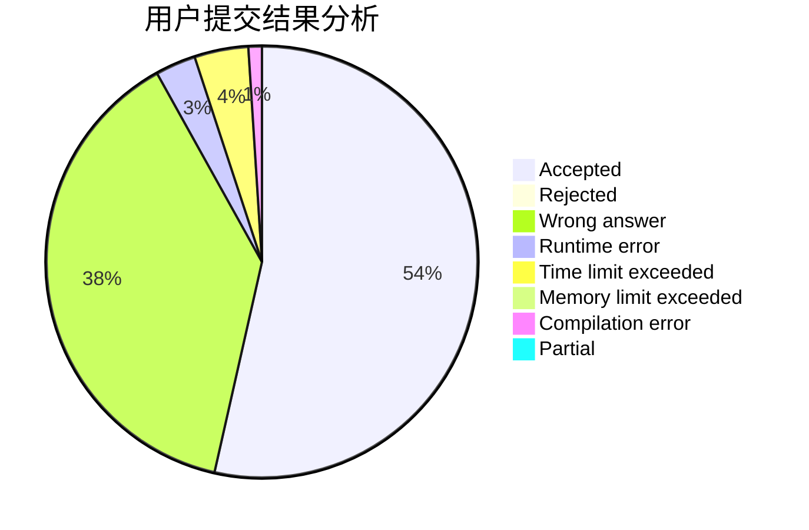
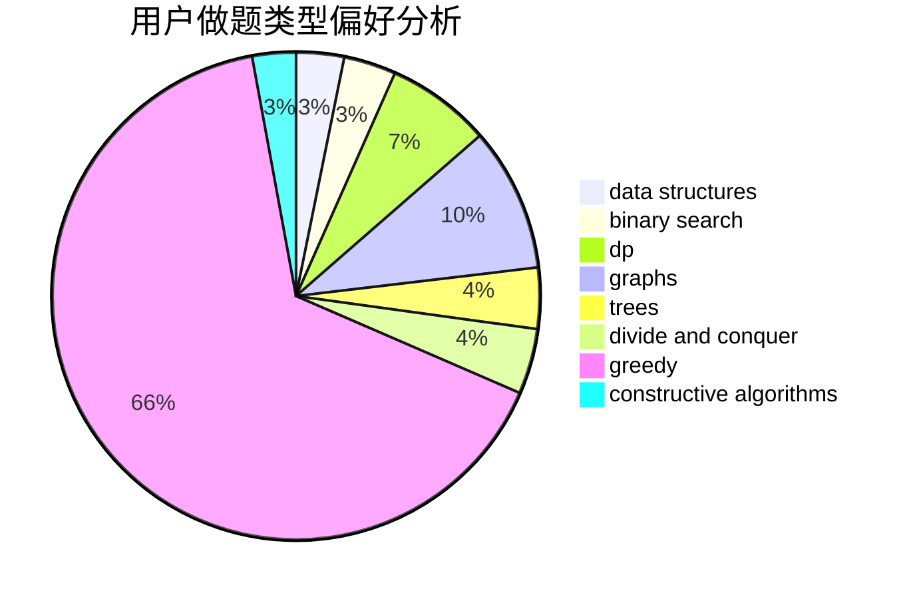
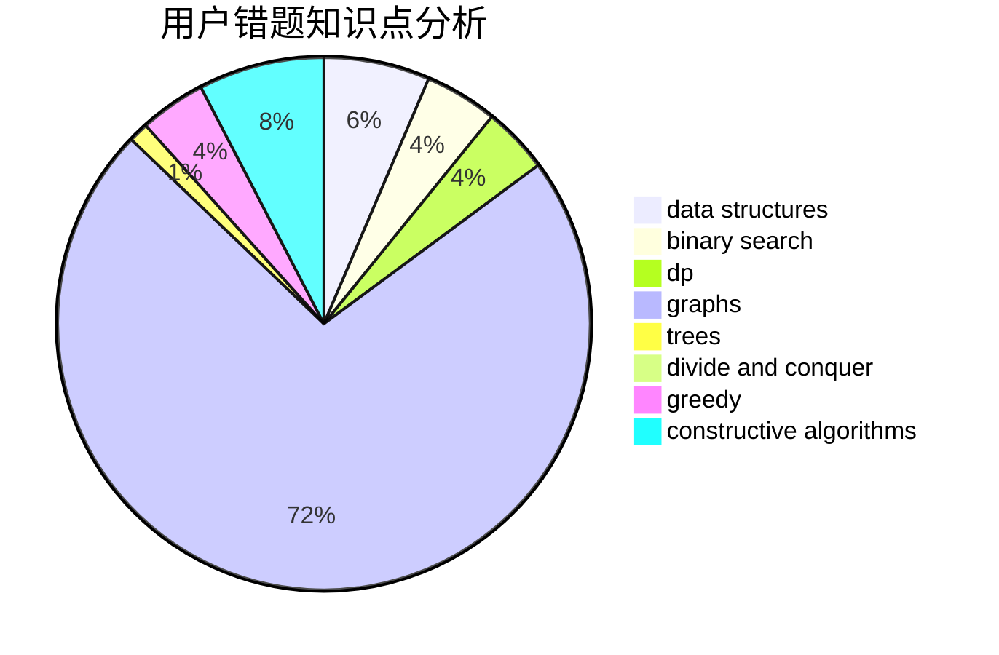

# ferrari430

<!-- tabs:start -->

#### **用户提交结果分析**

#### **用户做题类型偏好分析**

#### **用户错题知识点分析**

<!-- tabs:end -->
# 推荐题目
[900C](https://codeforces.com/contest/900/problem/C)		brute force,
                        data structures,
                        math		  
[1359D](https://codeforces.com/contest/1359/problem/D)		data structures,
                        dp,
                        implementation,
                        two pointers		  
[1151C](https://codeforces.com/contest/1151/problem/C)		constructive algorithms,
                        math		  
[113D](https://codeforces.com/contest/113/problem/D)		math,
                        matrices,
                        probabilities		  
[198B](https://codeforces.com/contest/198/problem/B)		shortest paths		  
[1066C](https://codeforces.com/contest/1066/problem/C)		implementation		  
[1479D](https://codeforces.com/contest/1479/problem/D)		binary search,
                        bitmasks,
                        brute force,
                        data structures,
                        probabilities,
                        trees		  
[1119G](https://codeforces.com/contest/1119/problem/G)		constructive algorithms,
                        implementation		  
[316E3](https://codeforces.com/contest/316E/problem/3)		data structures,
                        math		  
[1241B](https://codeforces.com/contest/1241/problem/B)		dsu,graphs,sortings,trees		  
